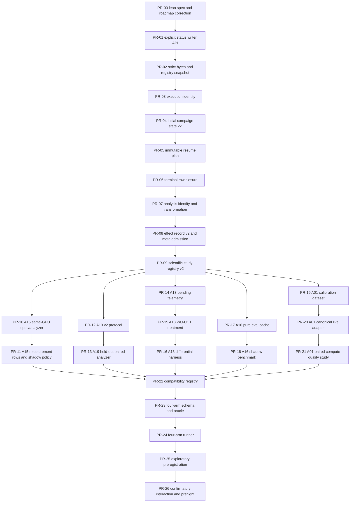

# Idea Foundry Trusted-Local Audit and Codex PR Execution Plan

> **Execution authority:** This document is the machine-oriented implementation
> plan for the trusted-local policy branch at `65ffe7fc`. It audits the policy and
> high-level roadmap but does not itself establish P0b-C1, authorize a scientific
> run, or promote an Idea Foundry claim.
>
> **For Codex and low-cost coding agents:** execute one PR section at a time in
> dependency order. Do not redesign the interfaces, merge PRs, edit historical
> v1 evidence, run a scientific campaign, or ask the user to choose between
> alternatives. Every remaining design choice is fixed below. Stop only at a
> named FAIL/STOP gate.

## 0. Audit verdict

The 2026-08-23 trusted-local policy is the correct architectural reset. QUARTZ
Idea Foundry is a personal research codebase operated by one trusted developer;
malicious same-UID writers, hostile Git configuration, mount attacks, deliberate
symlink substitution, signatures, anti-tamper custody, and security-oriented
installer state machines are not default requirements. The policy correctly
retains the controls that can change a scientific conclusion: clean source
identity, exact configurations and inputs, deterministic treatment definitions,
independent-unit membership, raw failures, atomic publication, idempotent
resume, execution-to-analysis lineage, and evidence-maturity separation.

The long-term roadmap has the right scientific sequence—execution identity,
lineage, solo-axis qualification, four-arm combination studies, then separately
powered interaction studies—but is not sufficiently deterministic for direct
execution by a low-cost coding model. It currently leaves module boundaries,
JSON schemas, function signatures, version migration, test nodes, and per-PR
scope partially implicit. It also tells Task 4 to modify the frozen schema-v1
study registry and `studies.py`, even though that module explicitly rejects
legacy mutation. That conflict must not reach implementation.

### 0.1 Accepted decisions

1. Keep the trusted-local threat model and focused-test policy.
2. Preserve the security-heavy P0b-C1 document as forensic history only.
3. Keep P0b-C1 at `NOT_ESTABLISHED` until a new lean implementation passes.
4. Keep execution identity, scientific design, and claim promotion separate.
5. Qualify solo axes before selecting combinations.
6. Use the initial priority order A15, A19, A13, A16, A01.
7. Keep exploratory joint dominance distinct from formal factorial interaction.
8. Do not run another omnibus 26-axis scientific campaign.

### 0.2 Blocking defects in the current high-level roadmap

| ID | Severity | Finding | Required correction |
|---|---|---|---|
| A-01 | BLOCKER | `configs/idea_foundry.studies.v1.json` and `quartz/idea_foundry/studies.py` are frozen legacy scientific paths, but Task 4 proposes editing them. | Leave both byte-stable. Create schema-v2 successors. |
| A-02 | BLOCKER | Task 4 combines five independent axes in one task, despite different Python/Rust substrates and falsifiers. | Use independent stacked PRs per axis and per mechanism/evidence boundary. |
| A-03 | BLOCKER | Task 3 combines campaign closure, raw inventory, analysis identity, transformation lineage, effect admission, and meta-analysis. | Split closure, lineage, and scientific-effect admission into separate PRs. |
| A-04 | HIGH | The planned P0b-C1 interfaces name `ExecutionIdentity`, `InitialStatePlan`, and `ResumePlan` but do not define their exact fields or serialized forms. | Use the exact dataclasses and JSON payloads in PR-03 through PR-05 below. |
| A-05 | HIGH | `status_schema.py` is minified under `# fmt: off`, and its lattice validator is broader than the writer subsets needed by campaign code. | Reformat it and add explicit writer-context validators before state v2. |
| A-06 | HIGH | Current `sequential.py` is schema v1, rereads live registry data while validating/resuming, and mutates failed state during some rejection paths. | Replace the fingerprint path with captured-byte-derived state and immutable resume planning. |
| A-07 | HIGH | A15 v1 means CUDA/CPU diagnostic ratio, A19 v1 means proxy rank-percentile, A13/A16 remain synthetic or NOOP, and A01 is not independently calibrated. | Add versioned v2 estimands; never rewrite the meanings of historical IDs. |
| A-08 | HIGH | Current meta-analysis compatibility uses only six fields and allows two-effect random-effects output. | Add estimand version, lineage, membership, controller identity, evidence maturity, and small-k dispositions. |
| A-09 | MEDIUM | The roadmap hard-codes a particular GPU/RAM description even though machine snapshots have changed. | Capture hardware/runtime per run; do not encode one workstation model in study semantics. |
| A-10 | MEDIUM | The security-heavy spec remains at the familiar `P0B_C1_EXECUTION_SEAL_SPEC.md` path and may attract agents despite the superseded banner. | Never edit or implement from it. Create `P0B_C1_TRUSTED_LOCAL_SPEC.md` as the sole successor. |
| A-11 | MEDIUM | Full-suite policy is sensible but lacks a dependency-bounded integration matrix for shared modules. | Use the exact focused commands in each PR; reserve full gates for PR-26 preflight. |
| A-12 | MEDIUM | The current roadmap describes desired behavior but often omits complete code skeletons and negative tests. | This plan supplies concrete signatures, payloads, test names, and failure gates. |

### 0.3 Constructive design correction

Use six layers and never cross them in one PR:

```text
L0  policy/specification
L1  status + strict parsing + captured registry
L2  execution identity + campaign state + resume
L3  raw closure + analysis lineage + scientific effect admission
L4  versioned solo-axis studies
L5  four-arm combination substrate
L6  authorized exploratory/confirmatory execution and claims
```

The word `seal` should not be used for the new trusted-local module. The module
name is `execution_identity.py`; hashes identify a research object and detect
accidental drift, not hostile tampering.

---

## 1. Global agent contract

### 1.1 Source-of-truth precedence

1. The user-owned trusted-local decision in
   `docs/idea_foundry/RESEARCH_TRUST_MODEL_20260823.md`.
2. This audited machine plan.
3. The new PR-00 lean specification after it lands.
4. Current source code and focused tests.
5. The high-level long-term roadmap.
6. Superseded or frozen forensic documents.

A lower item may not override a higher item.

### 1.2 Fixed repository and branch protocol

For PR-00 only:

```bash
git fetch origin audit/idea-foundry-research-trust-policy-20260823
git switch --detach 65ffe7fc16ef5ff15f402894590b61bc6c62b426
git switch -c agent/foundry-pr00-lean-spec
```

For every later PR:

```bash
git fetch origin <PREVIOUS_ACCEPTED_BRANCH>
git switch --detach <PREVIOUS_ACCEPTED_SHA>
git switch -c agent/foundry-<PR_ID>-<slug>
```

Rules:

- One PR section equals one branch and one primary commit.
- A repair amends that commit; do not add “fix fix” commit chains.
- Do not merge two PR sections because they touch the same file.
- Do not open or merge a GitHub PR unless separately authorized.
- Always push the branch after the local PASS gate.
- Record the exact commit SHA in the handoff message.
- Never use `git reset --hard`, `git clean`, stash, or delete untracked user data.

### 1.3 Frozen files

The following are historical inputs. Do not modify them in implementation PRs:

```text
configs/idea_foundry.studies.v1.json
quartz/idea_foundry/studies.py
docs/idea_foundry/P0B_C1_EXECUTION_SEAL_SPEC.md
quartz_idea_foundry_skeleton.zip
quartz_idea_foundry_skeleton.patch
docs/idea_foundry/26AXIS_AND_FACTORIAL_AUDIT_REPORT.md
docs/idea_foundry/receipts/20260817_26axis_and_factorial.receipt.json
docs/idea_foundry/evidence/20260818_confirmatory_factorial_evidence.json
```

A test may read the first two to prove compatibility/freeze. No PR may change
their bytes unless the PR explicitly says “documentation banner only”; none
below does.

### 1.4 Prohibited automatic actions

No PR below authorizes any of these:

```text
real scientific run
GPU campaign
new 26-axis campaign
result or receipt publication
claim-ledger promotion above SPECIFIED/IMPLEMENTED/SMOKE-VALIDATED
pair selection based on observed combination performance
automatic merge
```

### 1.5 Default verification rule

Every PR runs:

```bash
git diff --check
./venv/bin/ruff check <CHANGED_PYTHON_FILES>
./venv/bin/ruff format --check <CHANGED_PYTHON_FILES>
```

and only the exact pytest/Cargo nodes listed in that PR. A command that selects
zero tests is a FAIL. Do not replace a failing assertion with skip/xfail. Do not
run a full repository suite unless PR-26 or a named focused failure demonstrates
cross-cutting risk.

### 1.6 No-question policy

Do not ask the user to choose names, schemas, baselines, or endpoints. Use the
names and contracts below. If the current source conflicts with this plan:

1. preserve frozen v1 behavior;
2. implement the v2 successor;
3. add a compatibility test;
4. stop with `BLOCKED_SOURCE_CONFLICT` only if both cannot coexist.

---

## 2. Current source anchor map

Line numbers refer to branch `65ffe7fc` and are audit navigation hints. After
prior PRs shift lines, locate the named symbol with `rg -n` and patch the symbol,
not an old numeric offset.

| File | Current line/symbol anchor | Planned use |
|---|---|---|
| `quartz/idea_foundry/status_schema.py` | entire file, approximately lines 1–70; `ExecutionStatus`, `validate_status_v2`, `is_resumable` | PR-01 writer-safe status API |
| `quartz/idea_foundry/axis_workflow.py` | approximately 70–125; `_reject_nonfinite_constant`, `load_json_strict`, `load_jsonl_strict` | PR-02 byte decoder |
| same | approximately 127–240; `load_workflow_specs` | PR-02 payload parser |
| same | approximately 260–420; `run_axis_gate`, `_validate_run_artifacts` | PR-06 closure integration |
| same | approximately 420–650; `analyze_axis`, `validate_axis_analysis` | PR-07 lineage integration |
| `quartz/idea_foundry/sequential.py` | approximately 45–100; `resolve_campaign_root`, `resolve_run_root` | PR-04 simple local path/run ownership |
| same | approximately 100–170; `_fingerprint`, `_new_state`, `_save_state` | PR-03/04 replacement |
| same | approximately 170–225; `_validate_state` | PR-04 state v2 |
| same | approximately 310–470; `_validated_attempt`, `run_campaign` | PR-05 resume planning |
| `quartz/experiment_manifest.py` | approximately 35–70; `canonical_sha256`, `file_sha256`, `git_provenance` | reuse for research identity |
| same | approximately 145–185; `atomic_json_dump` | reuse for atomic local publication |
| `quartz/idea_foundry/meta_analysis.py` | approximately 330–430; `EFFECT_KEYS`, `validate_effect_record` | PR-08 v2 effect contract |
| same | approximately 430–530; `_group_key`, `pool_effect_group` | PR-08 compatibility/small-k |
| `quartz/idea_foundry/control.py` | `A01StopCouncil` near file top | PR-22/23 A01 v2 |
| `quartz/idea_foundry/search.py` | `A13PendingFlowWuUct`, `A15ServiceCurveScheduler`, `A16MonteCarloGraphSharing` | PR-14 through PR-21 |
| `quartz/idea_foundry/learning.py` | `A19RwRestLiteEvaluator` | PR-12/13 A19 v2 |
| `src/mcts/foundry/policy.rs` | entire file currently A01-only | PR-23 live A01 variant only |
| `src/mcts/node.rs` | `MctsEdge`, `virtual_losses`, `virtual_value` | PR-16 pending telemetry review |
| `src/mcts/policy/trait_def.rs` | `EdgeView`, especially `n_virtual` and `o_a` | PR-16 semantic naming |
| `src/mcts/tt.rs` | `TranspositionTable`, `TtBucket`, `TtSlot` | PR-19/20 A16 eval cache; do not merge edge stats |
| `quartz/experiments/a15_matched_service_curve.py` | `validate_config`, `run_matched_measurements` | PR-10/11 A15 reuse |
| `quartz/idea_foundry/a19_proxy.py` | whole file | frozen proxy-screen v1 input only |
| `quartz/idea_foundry/a19_ablation.py` | whole file | PR-12/13 reuse only after v2 wrapper |
| `tests/test_idea_foundry_axis_workflows.py` | strict JSON tests at top; sequential monolith in lower half | PR-02 through PR-06 migration |
| `tests/test_idea_foundry_meta_analysis.py` | effect helpers and pooling tests | PR-08 |

Before patching a symbol, run:

```bash
rg -n "^(class|def) <SYMBOL>|^pub (struct|enum|fn) <SYMBOL>|^impl .*<SYMBOL>" <FILE>
```

---

## 3. PR dependency DAG



Parallel execution is forbidden for PR-00 through PR-09. After PR-09, axis
chains may be developed independently but must not be merged into a combination
branch until all five chain heads are reviewed.

---

# Foundation PRs

## PR-00 — Freeze the lean trusted-local successor authority

```yaml
id: PR-00
depends_on: []
branch: agent/foundry-pr00-lean-spec
commit: "docs(foundry): specify trusted-local execution identity"
science_effect: none
```

### Files

- Create `docs/idea_foundry/P0B_C1_TRUSTED_LOCAL_SPEC.md`.
- Modify `docs/CLAIM_LEDGER.md` only in the 2026-08-23 operating-model table.
- Modify `docs/plans/2026-08-24-idea-foundry-long-term-development.md` only to
  link to this audited plan and mark its Task 1–6 prose as overview, not direct
  patch authority.

### Required content

The new spec must contain these exact interfaces and no implementation code:

```python
@dataclass(frozen=True)
class FileIdentity:
    path: str
    size_bytes: int
    sha256: str

@dataclass(frozen=True)
class RuntimeIdentity:
    python_executable: str
    python_version: str
    platform: str
    argv: tuple[str, ...]

@dataclass(frozen=True)
class ExecutionIdentity:
    schema_version: int
    git_head: str
    git_dirty: bool
    axis_registry: FileIdentity
    lab_registry: FileIdentity
    source_files: tuple[FileIdentity, ...]
    runtime: RuntimeIdentity

@dataclass(frozen=True)
class ExecutionCapture:
    identity: ExecutionIdentity
    identity_sha256: str
    axis_registry_bytes: bytes
    lab_registry_bytes: bytes
    specs: tuple[AxisWorkflowSpec, ...]

@dataclass(frozen=True)
class InitialStatePlan:
    identity_payload: dict[str, object]
    identity_sha256: str
    state_payload: dict[str, object]

@dataclass(frozen=True)
class ResumePlan:
    prior_state_sha256: str
    next_state: dict[str, object]
    retry_axis_id: str
    retry_attempt_number: int
    verified_terminal_axis_ids: tuple[str, ...]
```

The spec must explicitly state:

- ordinary `git rev-parse HEAD` and clean `git status` are research identity,
  not security proof;
- config bytes are read once and state derives from those bytes;
- new run uses `mkdir(exist_ok=False)` and a persistent local flock file;
- rejected resume leaves prior state, attempts, results, logs, and summary bytes
  unchanged;
- only failed inactive campaign state may resume;
- historical v1 study registry/module remain frozen;
- no hostile Git, mount, symlink-race, signature, or anti-tamper cases;
- no real run or result in this PR.

### Documentation test

```bash
python - <<'PY'
from pathlib import Path
files = [
    Path("docs/idea_foundry/P0B_C1_TRUSTED_LOCAL_SPEC.md"),
    Path("docs/CLAIM_LEDGER.md"),
    Path("docs/plans/2026-08-24-idea-foundry-long-term-development.md"),
]
for path in files:
    text = path.read_text(encoding="utf-8")
    assert "trusted-local" in text
assert "ExecutionIdentity" in files[0].read_text()
assert "ResumePlan" in files[0].read_text()
assert "P0B-C1=NOT_ESTABLISHED" in files[0].read_text()
assert "configs/idea_foundry.studies.v1.json" in files[0].read_text()
PY
git diff --check
```

### PASS gate

- The new spec exists and declares P0b-C1 not established.
- Every Markdown relative link resolves.
- No Python/Rust/config/result file changed.

### FAIL gate

- Any security-heavy mechanism is copied from the superseded spec.
- Any implementation or run is described as completed.
- Any v1 study file is authorized for mutation.

---

## PR-01 — Replace minified status logic with explicit writer-safe status API

```yaml
id: PR-01
depends_on: [PR-00]
branch: agent/foundry-pr01-status-writers
commit: "refactor(foundry): make status writer contracts explicit"
```

### Files

- Modify `quartz/idea_foundry/status_schema.py`.
- Create `tests/test_idea_foundry_status_schema.py`.
- Modify status-related imports/assertions in
  `tests/test_idea_foundry_axis_workflows.py` only where required.

### Current anchors

- Replace the entire current `# fmt: off` body.
- Preserve public names used by existing code:
  `ExecutionStatus`, `ContractStatus`, `EffectStatus`, `EvidenceMaturity`,
  `PromotionStatus`, `StatusSchemaError`, `status_v2`, `first_gate_status`,
  `validate_status_v2`, `validate_axis_status`, `validate_campaign_status`,
  `transition_status`, `is_legacy_status`, `is_success`, `is_resumable`,
  `is_poolable`.

### Required new API

```python
class StatusWriter(StrEnum):
    CAMPAIGN = "campaign"
    AXIS = "axis"
    ANALYSIS = "analysis"
    META_ANALYSIS = "meta_analysis"


def planned_status() -> dict[str, object]: ...
def running_status() -> dict[str, object]: ...
def failed_status() -> dict[str, object]: ...
def succeeded_status() -> dict[str, object]: ...
def skipped_status() -> dict[str, object]: ...


def validate_writer_status(
    value: object,
    *,
    writer: StatusWriter,
    axis_id: str | None = None,
) -> dict[str, object]: ...


def is_terminal_axis_status(value: object, *, axis_id: str) -> bool: ...
def is_resume_eligible_campaign_status(value: object) -> bool: ...
```

Writer rules:

- campaign accepts only running, failed, succeeded;
- normal axis accepts planned, running, failed, succeeded;
- A10 accepts planned, running, failed, skipped and never succeeded;
- analysis/meta-analysis accept only succeeded with
  `effect=non_estimable` or an explicitly admitted scientific status from PR-08;
- `is_resumable` remains a compatibility alias for terminal axis artifacts and
  must call `is_terminal_axis_status`, not campaign-resume logic;
- exact built-in types: reject `schema_version=True`, `2.0`, missing/extra keys,
  and enum subclasses/coercions.

### Required tests

Create exact test names:

```text
test_status_v2_round_trip_for_all_canonical_rows
test_status_v2_rejects_bool_float_alias_and_extra_fields
test_campaign_writer_rejects_planned_and_skipped
test_a10_writer_accepts_skipped_and_rejects_success
test_normal_axis_writer_accepts_success_and_rejects_skipped
test_resume_eligible_campaign_is_failed_only
test_legacy_helpers_preserve_existing_axis_artifact_semantics
```

### Commands

```bash
./venv/bin/python -m pytest -q \
  tests/test_idea_foundry_status_schema.py \
  tests/test_idea_foundry_axis_workflows.py \
  -k "status or legacy"
./venv/bin/ruff check quartz/idea_foundry/status_schema.py tests/test_idea_foundry_status_schema.py tests/test_idea_foundry_axis_workflows.py
./venv/bin/ruff format --check quartz/idea_foundry/status_schema.py tests/test_idea_foundry_status_schema.py tests/test_idea_foundry_axis_workflows.py
git diff --check
```

### PASS gate

All selected nodes execute and pass; no `# fmt: off`, semicolon-compressed code,
new `# noqa`, or xfail is introduced.

---

## PR-02 — Add strict byte decoding and captured registry parsing

```yaml
id: PR-02
depends_on: [PR-01]
branch: agent/foundry-pr02-registry-snapshot
commit: "refactor(foundry): parse workflow registry from captured bytes"
```

### Files

- Modify `quartz/idea_foundry/axis_workflow.py`.
- Modify `tests/test_idea_foundry_axis_workflows.py`.

### Patch anchors

1. Around `_reject_nonfinite_constant` and `load_json_strict`, add:

```python
def decode_json_strict(document: bytes | str, *, label: str) -> object:
    try:
        text = document.decode("utf-8") if isinstance(document, bytes) else document
    except UnicodeDecodeError as exc:
        raise AxisWorkflowError(f"invalid UTF-8 in {label}: {exc}") from exc
    try:
        return json.loads(
            text,
            parse_constant=_reject_nonfinite_constant,
            parse_float=_parse_finite_float,
            object_pairs_hook=_reject_duplicate_members,
        )
    except (json.JSONDecodeError, AxisWorkflowError) as exc:
        raise AxisWorkflowError(f"invalid JSON in {label}: {exc}") from exc
```

2. Rewrite `load_json_strict(path)` as one call to `decode_json_strict` on
   `path.read_bytes()`.
3. Extract the body of `load_workflow_specs()` into:

```python
def parse_workflow_specs(
    axes_payload: object,
    lab_payload: object,
    *,
    repo_root: Path = REPO_ROOT,
) -> tuple[AxisWorkflowSpec, ...]: ...
```

4. `load_workflow_specs()` reads the two files and delegates to
   `parse_workflow_specs()`.
5. Add both new functions to `__all__`.

### Invariants

- No `str(row.get(...))` coercion for IDs, roles, paths, or status fields.
- Registry values must already be non-empty built-in strings.
- Axis/lane duplicates and exact A01–A26 coverage remain enforced.
- The suite order remains the current `first-gate-all` order, not lexical order.
- Script paths are derived from validated slugs and `repo_root`.

### Required tests

```text
test_decode_json_strict_rejects_duplicate_nonfinite_overflow_and_utf8
test_parse_workflow_specs_matches_file_loader_exactly
test_parse_workflow_specs_does_not_reread_registry_files
test_parse_workflow_specs_rejects_string_coercion_inputs
test_parse_workflow_specs_preserves_current_suite_order
```

For the no-reread test, load bytes first, monkeypatch `Path.read_bytes` to raise,
then call `parse_workflow_specs` and assert success.

### Commands

```bash
./venv/bin/python -m pytest -q tests/test_idea_foundry_axis_workflows.py \
  -k "strict_json or decode_json or workflow_specs or registry"
./venv/bin/ruff check quartz/idea_foundry/axis_workflow.py tests/test_idea_foundry_axis_workflows.py
./venv/bin/ruff format --check quartz/idea_foundry/axis_workflow.py tests/test_idea_foundry_axis_workflows.py
git diff --check
```

---

## PR-03 — Capture a lean trusted-local execution identity

```yaml
id: PR-03
depends_on: [PR-02]
branch: agent/foundry-pr03-execution-identity
commit: "feat(foundry): capture trusted-local execution identity"
```

### Files

- Create `quartz/idea_foundry/execution_identity.py`.
- Create `tests/test_idea_foundry_execution_identity.py`.
- Modify `quartz/idea_foundry/__init__.py` only to export the public types.

### Exact dataclasses

```python
@dataclass(frozen=True)
class FileIdentity:
    path: str
    size_bytes: int
    sha256: str

    def to_payload(self) -> dict[str, object]: ...


@dataclass(frozen=True)
class RuntimeIdentity:
    python_executable: str
    python_version: str
    platform: str
    argv: tuple[str, ...]

    def to_payload(self) -> dict[str, object]: ...


@dataclass(frozen=True)
class ExecutionIdentity:
    schema_version: int
    git_head: str
    git_dirty: bool
    axis_registry: FileIdentity
    lab_registry: FileIdentity
    source_files: tuple[FileIdentity, ...]
    runtime: RuntimeIdentity

    def to_payload(self) -> dict[str, object]: ...


@dataclass(frozen=True)
class ExecutionCapture:
    identity: ExecutionIdentity
    identity_sha256: str
    axis_registry_bytes: bytes
    lab_registry_bytes: bytes
    specs: tuple[AxisWorkflowSpec, ...]
```

### Exact public functions

```python
def capture_execution_identity(
    *,
    repo_root: Path,
    entrypoint: Path,
    argv: Sequence[str],
) -> ExecutionCapture: ...


def validate_execution_identity_payload(value: object) -> dict[str, object]: ...
```

### Implementation decisions

- Use normal `git rev-parse HEAD` and
  `git status --porcelain=v1 --untracked-files=all`.
- Git command failure is `ExecutionIdentityError`.
- Any non-empty status is `ExecutionIdentityError("working tree is dirty")`.
- Read the two config files once as bytes.
- Parse those bytes through `decode_json_strict` and `parse_workflow_specs`.
- `source_files` is exactly these four identities in this order:

```text
quartz/idea_foundry/status_schema.py
quartz/idea_foundry/axis_workflow.py
quartz/idea_foundry/sequential.py
scripts/idea_foundry_run_all.py
```

- `identity_sha256 = canonical_sha256(identity.to_payload())` using
  `quartz.experiment_manifest.canonical_sha256`.
- Runtime identity records actual values; do not hard-code a GPU, RAM size, or
  workstation model.
- Do not sanitize hostile Git environment, inspect mounts, reject symlink races,
  verify Git object graphs, or create ownership manifests.

### Tests

Use a temporary ordinary Git repository. Exact names:

```text
test_capture_execution_identity_records_clean_commit_configs_sources_runtime
test_capture_execution_identity_rejects_tracked_and_untracked_drift
test_capture_execution_identity_fails_when_git_identity_is_unavailable
test_capture_uses_one_config_read_and_builds_specs_from_captured_bytes
test_identity_hash_is_stable_under_dict_serialization_order
test_identity_payload_rejects_missing_extra_and_wrong_types
```

### Commands

```bash
./venv/bin/python -m pytest -q tests/test_idea_foundry_execution_identity.py
./venv/bin/ruff check quartz/idea_foundry/execution_identity.py quartz/idea_foundry/__init__.py tests/test_idea_foundry_execution_identity.py
./venv/bin/ruff format --check quartz/idea_foundry/execution_identity.py quartz/idea_foundry/__init__.py tests/test_idea_foundry_execution_identity.py
git diff --check
```

---

## PR-04 — Publish execution identity and schema-v2 initial campaign state

```yaml
id: PR-04
depends_on: [PR-03]
branch: agent/foundry-pr04-initial-state
commit: "feat(foundry): publish identity-bound campaign state"
```

### Files

- Create `quartz/idea_foundry/campaign_state.py`.
- Modify `quartz/idea_foundry/sequential.py`.
- Create `tests/test_idea_foundry_campaign_state.py`.
- Modify the narrow sequential tests in
  `tests/test_idea_foundry_axis_workflows.py`.

### Artifact names

```text
execution_identity.json
campaign_state.json
campaign_summary.json
.writer.lock              # operational file, never scientific evidence
```

### State payload

```json
{
  "schema_version": 2,
  "run_id": "...",
  "suite": "first-gate-all-sequential",
  "status": {"schema_version": 2, "execution": "running", "contract": "not_evaluated", "effect": "not_evaluated", "evidence_maturity": "contract_only", "promotion": "ineligible"},
  "seed": 0,
  "created_at": "...Z",
  "updated_at": "...Z",
  "execution_identity_path": "execution_identity.json",
  "execution_identity_sha256": "...",
  "claim_scope": "synthetic_contract_execution_only",
  "axes": []
}
```

Each axis row is built from `ExecutionCapture.specs`, never from a second config
read:

```json
{
  "order_index": 0,
  "axis_id": "A03",
  "slug": "uncertainty_decomposition",
  "lane_id": "A03.trace",
  "role": "trace",
  "status": {"...": "planned"},
  "attempts": []
}
```

### Public API

```python
def build_initial_state_plan(
    *, run_id: str, seed: int, capture: ExecutionCapture, now: str
) -> InitialStatePlan: ...


def validate_campaign_state_v2(
    value: object,
    *, expected_run_id: str | None = None,
    expected_identity_sha256: str | None = None,
) -> dict[str, object]: ...


def publish_initial_run(
    *, run_root: Path, plan: InitialStatePlan
) -> None: ...
```

### Run ownership and publication

- `run_root.mkdir(parents=False, exist_ok=False)` is the duplicate-start guard.
- Parent campaign directories may use `mkdir(parents=True, exist_ok=True)`.
- Create `.writer.lock` once and keep it permanently.
- Publish `execution_identity.json`, then validated `campaign_state.json`, using
  `atomic_json_dump`.
- If identity publication succeeds and state publication fails, preserve the run
  root and identity for inspection; do not reuse it automatically.
- No `axes/`, logs, attempts, summary, or result paths before state publication.

### Tests

```text
test_initial_state_is_derived_only_from_capture_specs
test_initial_publication_orders_identity_before_state_and_attempts
test_duplicate_new_run_is_rejected_without_overwrite
test_invalid_state_is_rejected_before_atomic_write
test_partial_identity_only_root_is_preserved_and_not_reused
test_state_v2_rejects_alias_types_extra_fields_and_wrong_axis_order
```

### Commands

```bash
./venv/bin/python -m pytest -q \
  tests/test_idea_foundry_execution_identity.py \
  tests/test_idea_foundry_campaign_state.py \
  tests/test_idea_foundry_axis_workflows.py \
  -k "initial or campaign_state or duplicate or status"
./venv/bin/ruff check quartz/idea_foundry/campaign_state.py quartz/idea_foundry/sequential.py tests/test_idea_foundry_campaign_state.py tests/test_idea_foundry_axis_workflows.py
./venv/bin/ruff format --check quartz/idea_foundry/campaign_state.py quartz/idea_foundry/sequential.py tests/test_idea_foundry_campaign_state.py tests/test_idea_foundry_axis_workflows.py
git diff --check
```

---

## PR-05 — Build immutable resume plans before any campaign mutation

```yaml
id: PR-05
depends_on: [PR-04]
branch: agent/foundry-pr05-resume-plan
commit: "feat(foundry): make campaign resume validation-first"
```

### Files

- Modify `quartz/idea_foundry/campaign_state.py`.
- Modify `quartz/idea_foundry/sequential.py`.
- Modify `tests/test_idea_foundry_campaign_state.py`.
- Modify only resume-related nodes in
  `tests/test_idea_foundry_axis_workflows.py`.

### Exact API

```python
def acquire_local_writer_lock(run_root: Path) -> ContextManager[None]: ...


def build_resume_plan(
    *,
    state: object,
    capture: ExecutionCapture,
    run_root: Path,
    now: str,
) -> ResumePlan: ...


def apply_resume_plan(
    *, state_path: Path, plan: ResumePlan
) -> None: ...
```

### Resume semantics

- Lock `.writer.lock` with `fcntl.flock(LOCK_EX | LOCK_NB)`.
- Opening/locking that operational file is not evidence mutation.
- Only campaign `failed` is resume-eligible.
- No active `process_outcome="running"` attempt may exist.
- Validate every terminal-prefix axis artifact through
  `validate_axis_analysis` before constructing the plan.
- Verify current execution identity hash equals the persisted identity hash.
- A rejected resume changes no state, attempt, log, summary, raw row, or analysis
  byte.
- A successful resume writes one state transition, clears the failed axis-level
  `failure_reason`, appends exactly one running attempt, and preserves all old
  attempt dictionaries byte-equivalently in content.
- Successful terminal-prefix axes receive `resume_action="verified_skip"` in the
  next state only.

### Required tests

```text
test_rejected_resume_is_zero_byte_mutation_for_every_campaign_artifact
test_terminal_prefix_artifact_failure_is_zero_byte_mutation
test_failed_to_successful_retry_clears_axis_failure_reason
test_resume_preserves_prior_attempt_records_and_appends_one_attempt
test_running_successful_and_legacy_campaigns_are_not_resume_eligible
test_second_local_resume_writer_is_rejected
test_resume_identity_drift_is_rejected_before_mutation
```

The zero-byte tests must snapshot `path.read_bytes()` for every file under the
run root before the call and compare after the exception.

### Commands

```bash
./venv/bin/python -m pytest -q \
  tests/test_idea_foundry_campaign_state.py \
  tests/test_idea_foundry_axis_workflows.py \
  -k "resume or retry or terminal_prefix or zero_byte or writer_lock"
./venv/bin/ruff check quartz/idea_foundry/campaign_state.py quartz/idea_foundry/sequential.py tests/test_idea_foundry_campaign_state.py tests/test_idea_foundry_axis_workflows.py
./venv/bin/ruff format --check quartz/idea_foundry/campaign_state.py quartz/idea_foundry/sequential.py tests/test_idea_foundry_campaign_state.py tests/test_idea_foundry_axis_workflows.py
git diff --check
```

### Foundation integration gate

Because PR-01 through PR-05 change shared status/registry/sequential contracts,
run this bounded integration set once here:

```bash
./venv/bin/python -m pytest -q \
  tests/test_idea_foundry_status_schema.py \
  tests/test_idea_foundry_execution_identity.py \
  tests/test_idea_foundry_campaign_state.py \
  tests/test_idea_foundry_axis_workflows.py \
  tests/test_idea_foundry_contracts_v2.py
```

No full repository suite is required.

---

## PR-06 — Close terminal raw campaign inventory without manufacturing evidence

```yaml
id: PR-06
depends_on: [PR-05]
branch: agent/foundry-pr06-raw-closure
commit: "feat(foundry): close terminal raw campaign inventory"
```

### Files

- Create `quartz/idea_foundry/campaign_closure.py`.
- Modify `quartz/idea_foundry/sequential.py`.
- Modify `quartz/idea_foundry/axis_workflow.py` only to expose validated artifact
  descriptors; do not change first-gate semantics.
- Create `tests/test_idea_foundry_campaign_closure.py`.

### Data model

```python
@dataclass(frozen=True)
class ArtifactIdentity:
    path: str
    size_bytes: int
    sha256: str

@dataclass(frozen=True)
class AttemptClosure:
    axis_id: str
    attempt_number: int
    status: dict[str, object]
    artifacts: tuple[ArtifactIdentity, ...]

@dataclass(frozen=True)
class CampaignClosure:
    schema_version: int
    run_id: str
    execution_identity_sha256: str
    state_sha256: str
    attempts: tuple[AttemptClosure, ...]
    negative_or_failed_attempts_preserved: bool
```

### Public API

```python
def validated_axis_artifact_identities(
    axis_id: str, *, input_dir: Path, analysis_dir: Path
) -> tuple[ArtifactIdentity, ...]: ...


def build_campaign_closure(
    *, run_root: Path, state: Mapping[str, object]
) -> CampaignClosure: ...


def publish_campaign_closure(
    *, run_root: Path, closure: CampaignClosure
) -> None: ...
```

Artifact: `campaign_closure.json`.

### Rules

- Closure is produced only for a successful terminal campaign.
- Every terminal attempt expected by the state must exist and validate.
- Failed prior attempts remain listed; do not delete or omit them.
- Closure does not contain effect records or evidence maturity above
  `contract_only`.
- `campaign_summary.json` is generated from validated state and closure, not
  treated as independent evidence.

### Tests and commands

```text
test_closure_lists_every_terminal_and_failed_attempt
test_closure_rejects_missing_or_hash_drifted_artifact
test_closure_rejects_running_or_failed_campaign
test_closure_has_no_effect_or_promotion_fields
test_summary_matches_state_and_closure
```

```bash
./venv/bin/python -m pytest -q tests/test_idea_foundry_campaign_closure.py tests/test_idea_foundry_axis_workflows.py -k "closure or summary or artifact"
./venv/bin/ruff check quartz/idea_foundry/campaign_closure.py quartz/idea_foundry/sequential.py quartz/idea_foundry/axis_workflow.py tests/test_idea_foundry_campaign_closure.py
./venv/bin/ruff format --check quartz/idea_foundry/campaign_closure.py quartz/idea_foundry/sequential.py quartz/idea_foundry/axis_workflow.py tests/test_idea_foundry_campaign_closure.py
git diff --check
```

---

## PR-07 — Separate analysis identity from execution identity

```yaml
id: PR-07
depends_on: [PR-06]
branch: agent/foundry-pr07-analysis-lineage
commit: "feat(foundry): record execution-to-analysis lineage"
```

### Files

- Create `quartz/idea_foundry/lineage.py`.
- Modify `quartz/idea_foundry/axis_workflow.py`.
- Modify `quartz/idea_foundry/meta_analysis.py` only to require lineage input;
  do not change statistical pooling yet.
- Create `tests/test_idea_foundry_lineage.py`.

### Exact types

```python
@dataclass(frozen=True)
class AnalysisIdentity:
    schema_version: int
    git_head: str
    git_dirty: bool
    source_files: tuple[FileIdentity, ...]
    runtime: RuntimeIdentity

@dataclass(frozen=True)
class TransformationManifest:
    schema_version: int
    execution_identity_sha256: str
    campaign_closure_sha256: str
    analysis_identity: AnalysisIdentity
    analysis_identity_sha256: str
    input_artifacts: tuple[ArtifactIdentity, ...]
    output_artifacts: tuple[ArtifactIdentity, ...]
    transform_name: str
    transform_version: str
```

### Rules

- `analyze_axis` writes `transformation_manifest.json` after derived artifacts.
- Analysis can use a later clean commit, but must record it separately.
- Every derived artifact must be reachable from explicit raw input identities.
- Hybrid inputs from two execution identities are rejected.
- Empty raw inventory is rejected.
- Existing historical analysis is inspection-only and not upgraded in place.

### Tests

```text
test_analysis_identity_is_distinct_from_execution_identity
test_transformation_manifest_binds_all_raw_and_derived_artifacts
test_hybrid_execution_inputs_are_rejected
test_empty_raw_inventory_is_rejected
test_historical_v1_analysis_is_not_rewritten_or_upgraded
```

### Commands

```bash
./venv/bin/python -m pytest -q tests/test_idea_foundry_lineage.py tests/test_idea_foundry_axis_workflows.py tests/test_idea_foundry_meta_analysis.py -k "lineage or transformation or hybrid or historical"
./venv/bin/ruff check quartz/idea_foundry/lineage.py quartz/idea_foundry/axis_workflow.py quartz/idea_foundry/meta_analysis.py tests/test_idea_foundry_lineage.py
./venv/bin/ruff format --check quartz/idea_foundry/lineage.py quartz/idea_foundry/axis_workflow.py quartz/idea_foundry/meta_analysis.py tests/test_idea_foundry_lineage.py
git diff --check
```

---

## PR-08 — Introduce scientific EffectRecordV2 and conservative admission

```yaml
id: PR-08
depends_on: [PR-07]
branch: agent/foundry-pr08-effect-v2
commit: "feat(foundry): version scientific effects and pooling admission"
```

### Files

- Create `quartz/idea_foundry/scientific_effects.py`.
- Modify `quartz/idea_foundry/meta_analysis.py`.
- Modify `tests/test_idea_foundry_meta_analysis.py`.
- Create `tests/test_idea_foundry_scientific_effects.py`.

### EffectRecordV2 exact fields

```python
@dataclass(frozen=True)
class EffectRecordV2:
    schema_version: int
    axis_id: str
    estimand_id: str
    estimand_version: int
    effect_scale: str
    reference_id: str
    unit: str
    higher_is_better: bool
    run_id: str
    independent_group_id: str
    independent_member_ids: tuple[str, ...]
    independent_members_sha256: str
    effect: float
    uncertainty_kind: str
    standard_error: float | None
    evidence_maturity: str
    claim_scope: str
    dataset_lineage_id: str
    controller_identity: str
    source_artifact_path: str
    source_artifact_sha256: str
```

### Separate exact-property record

```python
@dataclass(frozen=True)
class ExactPropertyRecord:
    schema_version: int
    property_id: str
    property_version: int
    result: str              # "proved" | "counterexample" | "unresolved"
    witness_artifact_path: str
    witness_artifact_sha256: str
```

Never encode an exact property with `standard_error=0` or a zero-width confidence
interval.

### Compatibility key

```python
EFFECT_COMPATIBILITY_KEYS_V2 = (
    "axis_id",
    "estimand_id",
    "estimand_version",
    "effect_scale",
    "reference_id",
    "unit",
    "higher_is_better",
    "evidence_maturity",
    "dataset_lineage_id",
    "controller_identity",
)
```

### Pooling disposition

```text
k = 1      INSUFFICIENT_INDEPENDENT_EFFECTS
k = 2..4   DESCRIPTIVE_ONLY; no inferential random CI
k >= 5     INFERENTIAL_POOLING_ELIGIBLE
```

`pooled_group_count` counts only `INFERENTIAL_POOLING_ELIGIBLE` groups.
Contract-only and diagnostic effects are never inferentially poolable.

### Required tests

```text
test_effect_v2_requires_explicit_member_list_and_matching_hash
test_effect_v2_rejects_contract_only_and_diagnostic_in_inferential_pool
test_effect_v2_separates_estimand_versions_and_lineages
test_exact_property_cannot_enter_sampling_pool
test_k_two_to_four_is_descriptive_only_without_random_ci
test_k_five_is_inferentially_eligible
test_pooled_group_count_counts_only_eligible_groups
```

### Commands

```bash
./venv/bin/python -m pytest -q tests/test_idea_foundry_scientific_effects.py tests/test_idea_foundry_meta_analysis.py
./venv/bin/ruff check quartz/idea_foundry/scientific_effects.py quartz/idea_foundry/meta_analysis.py tests/test_idea_foundry_scientific_effects.py tests/test_idea_foundry_meta_analysis.py
./venv/bin/ruff format --check quartz/idea_foundry/scientific_effects.py quartz/idea_foundry/meta_analysis.py tests/test_idea_foundry_scientific_effects.py tests/test_idea_foundry_meta_analysis.py
git diff --check
```

---

## PR-09 — Create the schema-v2 scientific study registry without executing it

```yaml
id: PR-09
depends_on: [PR-08]
branch: agent/foundry-pr09-study-v2
commit: "feat(foundry): add versioned scientific study contracts"
```

### Files

- Create `configs/idea_foundry.studies.v2.json`.
- Create `quartz/idea_foundry/scientific_studies.py`.
- Create `scripts/idea_foundry_scientific_study.py`.
- Create `tests/test_idea_foundry_scientific_studies.py`.
- Do not modify v1 registry/module.

### Registry top-level contract

```json
{
  "schema_version": 2,
  "suite": "priority-axis-scientific-studies-v2",
  "execution_authorized": false,
  "axes": []
}
```

Include exactly A15, A19, A13, A16, A01, in that order. Every entry contains:

```text
axis_id
study_id
study_version
implementation_status = "specified"
primary_estimand
reference_id
independent_unit
budget_contract
heldout_contract
falsifier
prohibited_inferences
```

No old estimand ID is reused with a new meaning.

### Public API

```python
@dataclass(frozen=True)
class ScientificStudySpecV2: ...

def load_scientific_study_specs_v2(...) -> tuple[ScientificStudySpecV2, ...]: ...
def validate_scientific_study_spec_v2(value: object) -> ScientificStudySpecV2: ...
def require_study_execution_authorized(spec: ScientificStudySpecV2) -> None: ...
```

CLI supports only:

```text
describe --axis A15
validate-registry
```

A `run` subcommand is not added in this PR.

### Tests

```text
test_v1_study_registry_and_module_bytes_are_unchanged
test_v2_registry_contains_exact_priority_order_and_unique_versioned_ids
test_v2_registry_rejects_reused_v1_estimand_with_changed_meaning
test_v2_describe_is_read_only
test_v2_execution_is_not_authorized
```

### Commands

```bash
./venv/bin/python -m pytest -q tests/test_idea_foundry_scientific_studies.py
./venv/bin/python scripts/idea_foundry_scientific_study.py validate-registry
./venv/bin/ruff check quartz/idea_foundry/scientific_studies.py scripts/idea_foundry_scientific_study.py tests/test_idea_foundry_scientific_studies.py
./venv/bin/ruff format --check quartz/idea_foundry/scientific_studies.py scripts/idea_foundry_scientific_study.py tests/test_idea_foundry_scientific_studies.py
git diff --check
```

---

# Solo-axis PRs

## PR-10 — A15 same-GPU scheduler estimand and held-out analyzer

```yaml
id: PR-10
depends_on: [PR-09]
branch: agent/foundry-pr10-a15-estimand
commit: "feat(foundry): specify A15 same-GPU scheduler study"
```

### Files

- Create `configs/idea_foundry/a15_scheduler.v2.json`.
- Create `quartz/idea_foundry/a15_scheduler_study.py`.
- Create `tests/test_idea_foundry_a15_scheduler.py`.
- Modify only the A15 v2 entry in `configs/idea_foundry.studies.v2.json`.

### Primary estimand

```text
estimand_id: same_gpu_scheduler_log_throughput_gain
estimand_version: 2
reference: best_fixed_cuda_inflight_1_selected_on_calibration_rows
candidate: constrained_schedule_selected_on_calibration_rows
endpoint: log(items_per_s_candidate / items_per_s_reference)
constraint: evaluation p95_wave_latency_ms <= configured max_p95_wave_latency_ms
independent_unit: heldout workload family x repetition block
```

CPU rows remain parity/diagnostic inputs and never enter the primary effect.
Calibration rows select schedules; evaluation rows estimate the effect. The same
row may not perform both roles.

### API

```python
def split_a15_rows(rows, *, calibration_repetitions, evaluation_repetitions): ...
def choose_constrained_schedule(calibration_rows, config): ...
def analyze_a15_scheduler(evaluation_rows, selected_schedule, reference_schedule, config) -> EffectRecordV2 | None: ...
```

### Tests

```text
test_a15_primary_effect_uses_cuda_rows_only
test_a15_schedule_selection_and_evaluation_rows_are_disjoint
test_a15_reference_is_best_fixed_inflight_one_on_calibration
test_a15_latency_constraint_can_make_candidate_non_estimable
test_a15_known_synthetic_service_curve_recovers_log_gain
test_a15_row_permutation_does_not_change_result
```

### Commands

```bash
./venv/bin/python -m pytest -q tests/test_idea_foundry_a15_scheduler.py
./venv/bin/ruff check quartz/idea_foundry/a15_scheduler_study.py tests/test_idea_foundry_a15_scheduler.py
./venv/bin/ruff format --check quartz/idea_foundry/a15_scheduler_study.py tests/test_idea_foundry_a15_scheduler.py
git diff --check
```

---

## PR-11 — Extend A15 measurement rows and make the scheduler shadow-capable

```yaml
id: PR-11
depends_on: [PR-10]
branch: agent/foundry-pr11-a15-measurement
commit: "feat(foundry): emit A15 scheduler-ready measurement rows"
```

### Files

- Modify `quartz/experiments/a15_matched_service_curve.py`.
- Modify `scripts/a15_matched_service_curve.py`.
- Modify `quartz/idea_foundry/search.py` only inside
  `A15ServiceCurveScheduler`.
- Modify or create focused A15 tests; do not execute a GPU profile.

### Required measurement fields

Every raw repetition row gains:

```text
workload_family_id
study_phase                 # calibration | evaluation
model_source                # representative | checkpoint
checkpoint_sha256           # null only for representative
backend
batch_size
inflight
repetition
items_per_s
wave_latency_ms
semantic_parity_passed
```

`A15ServiceCurveScheduler.table` is replaced by a frozen policy object:

```python
@dataclass(frozen=True)
class A15SchedulePoint:
    batch_size: int
    inflight: int
    expected_items_per_s: float
    p95_wave_latency_ms: float

@dataclass
class A15ServiceCurveScheduler:
    policy_points: tuple[A15SchedulePoint, ...] = ()
    max_p95_wave_latency_ms: float = float("inf")
```

`best()` filters feasible points, then sorts by
`(-expected_items_per_s, p95_wave_latency_ms, batch_size, inflight)`.
It remains shadow/mechanism-only; no automatic production activation.

### Tests and Rust boundary

No Rust file changes. Required tests:

```text
test_a15_rows_emit_phase_family_and_model_identity
test_a15_checkpoint_identity_is_required_for_checkpoint_model
test_a15_scheduler_selects_fastest_feasible_point_deterministically
test_a15_scheduler_emits_no_proposal_when_all_points_infeasible
test_a15_scheduler_does_not_claim_cpu_or_play_strength
```

```bash
./venv/bin/python -m pytest -q tests/test_a15_matched_service_curve.py tests/test_idea_foundry_a15_scheduler.py tests/test_idea_foundry_contracts_v2.py -k "a15 or service_curve"
./venv/bin/ruff check quartz/experiments/a15_matched_service_curve.py scripts/a15_matched_service_curve.py quartz/idea_foundry/search.py tests/test_a15_matched_service_curve.py tests/test_idea_foundry_a15_scheduler.py
./venv/bin/ruff format --check quartz/experiments/a15_matched_service_curve.py scripts/a15_matched_service_curve.py quartz/idea_foundry/search.py tests/test_a15_matched_service_curve.py tests/test_idea_foundry_a15_scheduler.py
git diff --check
```

---

## PR-12 — Freeze A19 proxy v1 and specify a held-out loss v2 study

```yaml
id: PR-12
depends_on: [PR-09]
branch: agent/foundry-pr12-a19-protocol
commit: "feat(foundry): version A19 held-out evaluator protocol"
```

### Files

- Create `configs/idea_foundry/a19_evaluator.v2.json`.
- Create `quartz/idea_foundry/a19_study_v2.py`.
- Create `tests/test_idea_foundry_a19_v2.py`.
- Modify only A19 v2 entry in `configs/idea_foundry.studies.v2.json`.
- Do not modify `a19_proxy.py` semantics or v1 study registry.

### Version firewall

```text
A19.proxy_screen_v1
  historical/proxy only
  0.65 * policy_KL + 0.35 * value_MSE
  no v2 evidence inheritance

A19.heldout_joint_loss_v2
  primary loss = policy_cross_entropy + 1.5 * value_MSE
  reference = matched_residual_baseline
  effect = reference_loss - candidate_loss
  higher is better
```

### Study units and matching

```text
training pair: same initial checkpoint, replay order, learner updates, optimizer, batch size, controller mode
architecture match: direct parameter count and direct inference FLOPs within configured tolerance
independent top-level unit: training_seed
nested evaluation unit: heldout_trajectory_family
heldout rule: no trajectory family used in graph selection or training
```

### API

```python
def validate_a19_v2_config(value: object) -> dict[str, object]: ...
def validate_a19_training_pair(reference_manifest, candidate_manifest, config): ...
def analyze_a19_heldout_rows(rows, config) -> tuple[EffectRecordV2, ...]: ...
```

### Tests

```text
test_a19_v1_proxy_cannot_be_loaded_as_v2_evidence
test_a19_v2_rejects_graph_selection_using_heldout_rows
test_a19_v2_rejects_unmatched_training_or_direct_flops
test_a19_v2_requires_explicit_trajectory_family_membership
test_a19_v2_known_paired_loss_rows_recover_expected_effect
test_a19_v2_negative_and_non_estimable_results_are_valid_terminal_outputs
```

---

## PR-13 — Wire A19 v2 to existing ablation substrate without running training

```yaml
id: PR-13
depends_on: [PR-12]
branch: agent/foundry-pr13-a19-adapter
commit: "feat(foundry): adapt A19 ablation artifacts to v2"
```

### Files

- Modify `quartz/idea_foundry/a19_ablation.py` only through a new v2 adapter
  section; do not change v1 readers.
- Modify `scripts/a19_prepare_ablation.py` to add `prepare-v2` subcommand.
- Create `scripts/a19_analyze_v2.py`.
- Modify `tests/test_a19_ablation_readiness.py` and
  `tests/test_idea_foundry_a19_v2.py`.

### Required behavior

- `prepare-v2` creates configuration/manifests only; it does not train.
- Every manifest has `study_id`, `study_version=2`, `training_seed`,
  `trajectory_family_ids`, `initial_checkpoint_sha256`, `controller_identity`,
  and matched-compute fields.
- Analyzer reads already produced rows and emits v2 EffectRecord objects.
- Proxy shortlist may choose graph candidates only before held-out family access.
- No result is committed in this PR.

### Commands

```bash
./venv/bin/python -m pytest -q tests/test_a19_ablation_readiness.py tests/test_idea_foundry_a19_v2.py -k "v2 or heldout or matched"
./venv/bin/ruff check quartz/idea_foundry/a19_ablation.py scripts/a19_prepare_ablation.py scripts/a19_analyze_v2.py tests/test_a19_ablation_readiness.py tests/test_idea_foundry_a19_v2.py
./venv/bin/ruff format --check quartz/idea_foundry/a19_ablation.py scripts/a19_prepare_ablation.py scripts/a19_analyze_v2.py tests/test_a19_ablation_readiness.py tests/test_idea_foundry_a19_v2.py
git diff --check
```

---

## PR-14 — Define A13 pending-work telemetry without changing selection

```yaml
id: PR-14
depends_on: [PR-09]
branch: agent/foundry-pr14-a13-telemetry
commit: "feat(foundry): expose A13 pending-work telemetry"
```

### Files

- Modify `src/mcts/policy/trait_def.rs`.
- Modify the constructors of `EdgeView` in affected Rust files/tests.
- Modify `quartz/idea_foundry/search.py` A13 telemetry labels.
- Add Rust tests named `foundry_a13_pending_telemetry_*`.

### Fixed semantic decision

Current `EdgeView.n_virtual` is the virtual-loss reservation count. Use that as
pending/in-flight work in the first A13 substrate. Do not reinterpret `o_a`,
which is documented as outside/unmaterialized neighbor visits. Do not add a new
atomic field in this PR.

Rename only at the Foundry observation boundary:

```rust
impl EdgeView<'_> {
    pub fn pending_work(&self) -> u32 {
        self.n_virtual
    }
}
```

A13 Python telemetry must expose separately:

```text
completed_visits = edge.visits
pending_work = edge.virtual_visits
outside_visits = edge.pending or a newly renamed Python mirror field
```

If Python field names make this impossible without ambiguity, add read-only
properties; do not silently swap serialized meanings.

### PASS gate

- Selection scores are bit-identical before/after this PR.
- A Rust test proves telemetry observes a nonzero reservation during selection
  and returns to zero after removal.
- No A13 treatment is active.

### Commands

```bash
cargo test --features idea-foundry foundry_a13_pending_telemetry_
./venv/bin/python -m pytest -q tests/test_idea_foundry_contracts_v2.py -k a13
./venv/bin/ruff check quartz/idea_foundry/search.py tests/test_idea_foundry_contracts_v2.py
./venv/bin/ruff format --check quartz/idea_foundry/search.py tests/test_idea_foundry_contracts_v2.py
git diff --check
```

---

## PR-15 — Add opt-in A13 WU-UCT score treatment

```yaml
id: PR-15
depends_on: [PR-14]
branch: agent/foundry-pr15-a13-wuuct
commit: "feat(foundry): add opt-in A13 WU-UCT treatment"
```

### Files

- Create `src/mcts/foundry/a13_wuuct.rs`.
- Modify `src/mcts/foundry/mod.rs`.
- Modify `src/mcts/foundry/policy.rs` only to route an explicit A13 variant; do
  not modify A01 behavior.
- Modify `src/mcts/select.rs` only at the existing policy-adjustment hook.
- Add Rust tests `foundry_a13_wuuct_*`.

### Treatment equation

Use completed evidence for Q and evidence uncertainty. Use pending work only in
the exploration denominator:

```text
N_effective(a) = N_completed(a) + pending_weight * N_pending(a)
score_A13(a) = Q_completed(a)
             + c_puct * P(a) * sqrt(N_parent_completed + 1)
               / (1 + N_effective(a))
```

Defaults:

```text
pending_weight = 1.0
reference = adaptive virtual loss incumbent
mechanistic_control = fixed virtual loss
feature gate = idea-foundry
runtime default = disabled
```

Do not put pending work into Welford M2, completed visit count, or confidence
intervals.

### Required tests

```text
foundry_a13_wuuct_zero_pending_matches_reference_score
foundry_a13_wuuct_pending_penalizes_only_reserved_edge
foundry_a13_wuuct_does_not_change_completed_q_or_m2
foundry_a13_wuuct_disabled_is_bit_identical
foundry_a13_wuuct_pending_removed_restores_score
```

### Commands

```bash
cargo test --features idea-foundry foundry_a13_wuuct_
cargo test --features idea-foundry foundry_a13_pending_telemetry_
git diff --check
```

---

## PR-16 — Add A13 real-engine three-arm differential harness

```yaml
id: PR-16
depends_on: [PR-15]
branch: agent/foundry-pr16-a13-differential
commit: "feat(foundry): add A13 differential harness"
```

### Files

- Create `configs/idea_foundry/a13_differential.v2.json`.
- Create `scripts/a13_real_engine_differential.py`.
- Create `tests/test_idea_foundry_a13_differential.py`.
- Modify A13 v2 registry status to `implemented` but leave execution unauthorized.

### Arms

```text
adaptive_vl_incumbent   # primary reference
fixed_vl_control        # mechanism control
wuuct_treatment         # A13
```

### Required raw fields

```text
seed
position_family_id
thread_count
arm
move_id
selected_action
completed_evals
pending_peak
reservation_duplicate_rate
wallclock_ms
root_entropy
move_agreement_to_incumbent
```

No run occurs in this PR. Synthetic tests validate row pairing and known
contrasts. Promotion requires real engine rows later.

---

## PR-17 — Implement A16 pure state-evaluation cache without sharing edge stats

```yaml
id: PR-17
depends_on: [PR-09]
branch: agent/foundry-pr17-a16-cache
commit: "feat(foundry): add A16 pure evaluator cache"
```

### Files

- Create `src/mcts/foundry/a16_eval_cache.rs`.
- Modify `src/mcts/foundry/mod.rs`.
- Modify `src/mcts/mod.rs` only to optionally own the cache.
- Modify evaluator invocation boundary, not `MctsEdge` N/W/M2.
- Add Rust tests `foundry_a16_eval_cache_*`.

### Exact key and value

```rust
#[derive(Clone, Debug, Eq, Hash, PartialEq)]
pub struct EvalCacheKey {
    pub state_hash: u64,
    pub evaluator_id: String,
    pub ruleset_id: String,
    pub input_encoding_version: u32,
    pub cache_schema_version: u32,
}

#[derive(Clone, Debug)]
pub struct EvalCacheValue<M> {
    pub policy: Vec<(M, f32)>,
    pub value: f32,
}
```

### Hard invariant

The cache stores only immutable evaluator outputs. It never stores or shares:

```text
edge N
edge W/Q
edge M2
virtual loss
pending work
parent-specific priors after root noise
```

The existing transposition table remains unchanged in this PR.

### Tests

```text
foundry_a16_eval_cache_same_key_hits_once
foundry_a16_eval_cache_evaluator_or_encoding_change_misses
foundry_a16_eval_cache_parent_edge_stats_remain_distinct
foundry_a16_eval_cache_disabled_matches_existing_evaluator_calls
foundry_a16_eval_cache_capacity_eviction_preserves_correctness
```

---

## PR-18 — Add A16 shadow telemetry and bounded performance harness

```yaml
id: PR-18
depends_on: [PR-17]
branch: agent/foundry-pr18-a16-benchmark
commit: "feat(foundry): add A16 cache benchmark harness"
```

### Files

- Create `configs/idea_foundry/a16_cache_benchmark.v2.json`.
- Create `scripts/a16_cache_benchmark.py`.
- Create `tests/test_idea_foundry_a16_benchmark.py`.
- Modify telemetry serialization only as needed.

### Primary diagnostic

```text
reference: cache disabled
candidate: pure eval cache enabled
primary: evaluator_call_reduction
secondary: wallclock_change, cache_hit_rate, peak_entries, RSS delta, move agreement
```

Call reduction alone is not an efficacy or production PASS. Future promotion
requires wall-clock improvement and quality non-inferiority under a separate run.

---

## PR-19 — Build the A01 calibration dataset contract

```yaml
id: PR-19
depends_on: [PR-09]
branch: agent/foundry-pr19-a01-calibration
commit: "feat(foundry): define A01 calibration dataset"
```

### Files

- Create `configs/idea_foundry/a01_calibration.v2.json`.
- Create `quartz/idea_foundry/a01_calibration.py`.
- Create `tests/test_idea_foundry_a01_calibration.py`.
- Reuse Stage-7 trace readers; do not modify historical results.

### Dataset row

```text
checkpoint_id
training_seed
trajectory_family_id
position_id
budget
trace_mode                 # restart | resident_continuation
feature_contract_id
features                   # h1, p_flip, margins, slopes, omission, revisions
continued_budget
action_at_budget
action_at_continuation
flipped_at_continuation
quality_loss_delta
```

Missing `flipped_at_continuation` or quality label is invalid; never default it
to false/zero. Restart and resident-continuation strata are analyzed separately.
Top-level bootstrap unit is training seed; family is nested.

### Outputs

```text
calibration_rows.jsonl
calibration_summary.json
reliability_rows.jsonl
```

No live controller change in this PR.

---

## PR-20 — Version and route the canonical A01 live adapter

```yaml
id: PR-20
depends_on: [PR-19]
branch: agent/foundry-pr20-a01-live-v2
commit: "feat(foundry): route canonical A01 live risk variant"
```

### Files

- Modify `quartz/idea_foundry/control.py` to add `A01CalibratedRiskV2`; retain
  `A01StopCouncil` as legacy/skeleton.
- Modify `src/mcts/foundry/policy.rs` to use exact variant ID
  `A01.calibrated_risk_v2`.
- Modify Foundry config parser/telemetry.
- Add Python and Rust tests named `foundry_a01_v2_*`.

### Rules

- Generic aliases `A01`, `A01.stop_council`, and trace-stability names may not
  label v2 execution.
- The live adapter consumes a frozen calibration artifact ID and threshold.
- H1 and p_flip remain separate features; do not set H1 = 1 - p_flip.
- Missing slopes/omission features cause “continue”, not a low-risk fallback.
- Tactical override remains out of A01 unless a separate explicit signal is
  present.

### Tests

```text
foundry_a01_v2_rejects_alias_axis_ids
foundry_a01_v2_missing_calibration_or_features_never_stops
foundry_a01_v2_python_rust_frozen_feature_parity
foundry_a01_v2_shadow_and_active_share_observation_and_decision
foundry_a01_v2_stale_decision_never_halts
```

---

## PR-21 — Add A01 paired resource and quality analysis without executing it

```yaml
id: PR-21
depends_on: [PR-20]
branch: agent/foundry-pr21-a01-study
commit: "feat(foundry): add A01 paired compute-quality study"
```

### Files

- Create `configs/idea_foundry/a01_paired_study.v2.json`.
- Create `quartz/idea_foundry/a01_paired_study.py`.
- Create `scripts/a01_paired_study.py`.
- Create `tests/test_idea_foundry_a01_paired_study.py`.
- Update A01 v2 registry status to implemented; execution remains unauthorized.

### Two separate lanes

```text
resource_frontier:
  same nominal cap; report quality and realized compute jointly

fixed_realized_compute:
  reinvest saved evaluations according to preregistered rule
```

### Primary outputs

```text
compute_effect = log(candidate_evals / reference_evals)
quality_effect = candidate_score - reference_score
quality_noninferiority_margin = config value
```

Seed-conditioned and held-out-family generalization verdicts are separate.
Confirmatory quality PASS requires a nested seed→family bootstrap lower bound
above `-delta_q`. A 48-cell naive t-test is sensitivity only.

---

# Combination PRs

## PR-22 — Create a compatibility registry with all pairs initially blocked

```yaml
id: PR-22
depends_on: [PR-11, PR-13, PR-16, PR-18, PR-21]
branch: agent/foundry-pr22-combination-registry
commit: "feat(foundry): add combination compatibility registry"
```

### Files

- Create `configs/idea_foundry.combinations.v1.json`.
- Create `quartz/idea_foundry/combination_registry.py`.
- Create `tests/test_idea_foundry_combination_registry.py`.

### Initial candidate families

Register but mark `blocked_pending_solo_qualification`:

```text
A13 + A15
A15 + A16
A01 + A15
A01 + A13
A16 + A19
```

This list is mechanism-driven and may not be reordered by observed pair
performance. Every pair entry includes:

```text
pair_id
axis_a
axis_b
component_study_ids
shared_baseline_id
endpoint_id
endpoint_version
budget_contract
independent_unit
heldout_contract
expected_interference
eligibility_status
```

A pair becomes `eligible_for_exploration` only when both referenced solo studies
have reviewed admissible outputs. This PR cannot set that status because no real
solo evidence is produced by implementation PRs.

---

## PR-23 — Implement four-arm validation and a known-contrast synthetic oracle

```yaml
id: PR-23
depends_on: [PR-22]
branch: agent/foundry-pr23-four-arm-analysis
commit: "feat(foundry): validate four-arm combination contrasts"
```

### Files

- Create `quartz/idea_foundry/combination_studies.py`.
- Create `tests/test_idea_foundry_combination_studies.py`.

### Required row keys

```text
schema_version
pair_id
block_id
independent_group_id
independent_member_ids
arm                         # baseline | A_only | B_only | A_plus_B
endpoint_id
endpoint_version
effect_scale
score
realized_compute
checkpoint_sha256
schedule_sha256
treatment_trace_coverage
```

Every block must contain all four arms exactly once under the same starting
checkpoint, schedule, unit membership, and budget contract.

### Exact contrasts

```python
gain_a = y_a - y_0
gain_b = y_b - y_0
gain_ab = y_ab - y_0
interaction = y_ab - y_a - y_b + y_0
```

`gain_ab > max(gain_a, gain_b)` is exploratory joint dominance, not interaction.

### Synthetic oracle tests

```text
test_four_arm_validator_rejects_missing_duplicate_or_mismatched_blocks
test_four_arm_zero_interaction_oracle
test_four_arm_positive_interaction_oracle
test_four_arm_negative_interaction_oracle
test_joint_dominance_does_not_set_interaction_claim
test_row_permutation_is_invariant
```

---

## PR-24 — Add a read-only four-arm runner planner

```yaml
id: PR-24
depends_on: [PR-23]
branch: agent/foundry-pr24-combination-plan
commit: "feat(foundry): plan four-arm combination studies"
```

### Files

- Create `scripts/idea_foundry_combination_study.py`.
- Extend `combination_studies.py` with immutable plan generation.
- Extend tests.

CLI supports:

```text
describe --pair <PAIR_ID>
plan --pair <PAIR_ID> --output <PLAN_JSON>
validate-rows --plan <PLAN_JSON> --rows <ROWS_JSONL>
analyze --plan <PLAN_JSON> --rows <ROWS_JSONL> --output-dir <DIR>
```

There is no `run` subcommand. Plan generation rejects pairs not marked eligible.
The analyzer cannot change registry or plan bytes.

---

## PR-25 — Add preregistration and design-simulation gates for exploration

```yaml
id: PR-25
depends_on: [PR-24]
branch: agent/foundry-pr25-exploratory-design
commit: "feat(foundry): gate exploratory combination designs"
```

### Files

- Create `docs/idea_foundry/COMBINATION_STUDY_SPEC_V1.md`.
- Create `quartz/idea_foundry/design_simulation.py`.
- Create `tests/test_idea_foundry_design_simulation.py`.
- Do not authorize or execute real pairs.

Simulation inputs:

```text
number of independent seeds
families per seed
replicates per family
expected score variance
expected compute variance
noninferiority margin
interaction effect scenarios
false-pass target
power target
```

Output status is one of:

```text
DESIGN_FEASIBLE
BLOCKED_FALSE_PASS
BLOCKED_POWER
BLOCKED_RESOURCE
```

Pair list, endpoint, scale, margin, held-out family, and stopping rule are frozen
before outcome access.

---

## PR-26 — Add confirmatory interaction contracts and the one allowed full preflight

```yaml
id: PR-26
depends_on: [PR-25]
branch: agent/foundry-pr26-confirmatory-preflight
commit: "feat(foundry): add confirmatory interaction preflight"
```

### Files

- Create `quartz/idea_foundry/confirmatory_interaction.py`.
- Create `scripts/idea_foundry_confirmatory_preflight.py`.
- Create `tests/test_idea_foundry_confirmatory_interaction.py`.
- Modify `docs/CLAIM_LEDGER.md` only to add a `SPECIFIED` non-executed row.

### Confirmatory requirements

- new run ID and untouched held-out family;
- exact candidate commit SHA;
- preregistered interaction contrast and effect scale;
- explicit independent member lists;
- fixed compute/runtime contract;
- simulation gate from PR-25 passes;
- no outcome-derived pair or margin edits;
- negative/inconclusive/non-estimable outcomes remain publishable.

### Full preflight

This PR is the first allowed broad regression gate because it prepares a future
claim-bearing execution. It still does not run the scientific campaign.

```bash
./venv/bin/ruff check .
./venv/bin/ruff format --check .
./venv/bin/python -m pytest -q tests/ --ignore=tests/test_play_gui.py
cargo test --release --locked
cargo test --release --locked --features idea-foundry
QUARTZ_FORCE_EAGER_EVAL=1 \
QUARTZ_SAFE_RUNTIME=1 \
QUARTZ_SAFE_BOOTSTRAP_TARGET_CAP=2 \
QUARTZ_SAFE_SELFPLAY_PARALLEL_CAP=1 \
QUARTZ_SAFE_SELFPLAY_BATCH_GAMES_CAP=1 \
OMP_NUM_THREADS=1 MKL_NUM_THREADS=1 OPENBLAS_NUM_THREADS=1 NUMEXPR_NUM_THREADS=1 \
./venv/bin/python -m pytest -q -m real_loop tests/test_real_loop_e2e.py
git diff --check
```

PASS means the implementation substrate is eligible for a separately authorized
scientific run. It does not mean any axis, pair, efficacy, interaction, or
promotion claim passed.

---

## 4. Per-PR handoff template

Every coding agent must finish with this exact structure:

```text
PR_ID:
BRANCH:
BASE_SHA:
HEAD_SHA:
FILES_CHANGED:
OBSERVABLE_BEHAVIOR:
TEST_COMMANDS:
TEST_RESULTS:
RUFF_RESULTS:
DIFF_CHECK:
SCIENTIFIC_RUNS_EXECUTED: false
RESULTS_OR_RECEIPTS_CREATED: false
CLAIM_STATUS_CHANGE: none | specified_only
KNOWN_FOLLOWUPS:
NEXT_ALLOWED_PR:
```

Do not report “all tests pass” unless the exact named commands were executed.
Do not infer repository-wide health from focused tests. Do not use process or
provenance PASS as scientific evidence.

---

## 5. Final audit recommendation

Accept the trusted-local policy branch as a policy-and-roadmap artifact, with
this machine plan as the execution guide. Do not implement from the superseded
security-heavy spec, do not revive the failed execution-seal drafts, and do not
edit the frozen v1 scientific registry/module. The correct next coding unit is
PR-00, followed strictly by PR-01 through PR-09. Solo-axis development begins
only after the v2 execution/lineage/effect substrate is reviewed.

The minimum credible route is therefore:

```text
policy accepted
→ lean spec
→ explicit status writers
→ captured registry bytes
→ execution identity
→ initial state
→ immutable resume
→ raw closure
→ analysis lineage
→ effect admission
→ v2 study registry
→ solo mechanisms
→ four-arm substrate
→ exploratory design
→ separately authorized confirmation
```

This sequence spends engineering effort on accidental research errors and
scientific validity, not excluded adversarial security concerns.
