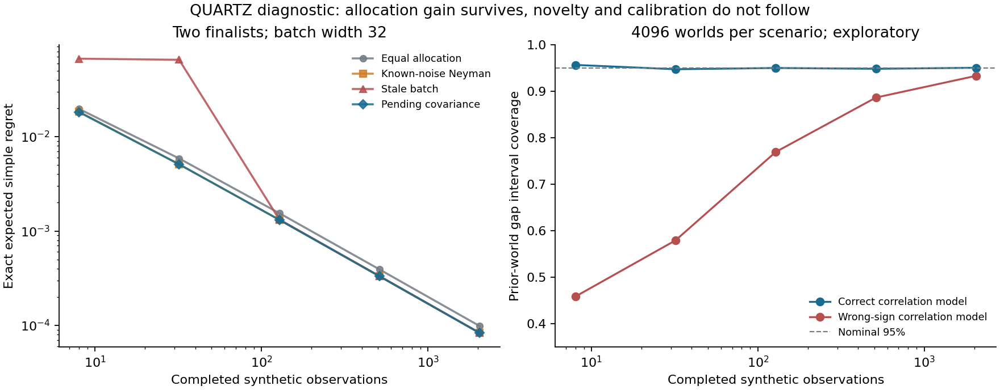

# QUARTZ beyond-AlphaZero 연구 평가와 업그레이드 제안

2026-09-07 · 평가 기준 `a74adb4e0176b0e7f0ad6cb7c1870a483b787749` · 과학적 주장과 구현·실행 상태를 구분한다.

**판정:** 원 동기는 유지할 가치가 있다. 현재 자료로는 ‘AlphaZero를 넘어서는 탐색 성능’이나 ‘고예산에서도 유지되는 QUARTZ 고유의 개선’을 입증하지 못했다. 가장 유망한 재구성은 **작은 신경망이 표현한 구조를 이용해 후보 간 효용 차이에 대한 belief를 유지하고, 새로운 계산이 그 차이를 얼마나 바꾸는지에 따라 정제·반박·후보 재개방·배치를 배분하는 연구**다. 이번 직접 계산에서는 큰 예산에서도 배분 효과가 남을 수 있음을 확인했지만, 강한 기존 배분법을 넘는 효과는 확인하지 못했다. 따라서 새 기여는 단순 KG나 조기 종료를 넘어, 구조적 evidence 전달·재사용·다봉형 반박 탐색이 실제로 추가하는 이득에서 찾아야 한다.

이 평가는 ‘연구를 작게 줄여서 성공으로 만들기’가 아니다. 원 질문을 계산 가능한 형태로 고정하고, 어떤 결과가 나오면 큰 연구 주장으로 올라갈 수 있는지 구체화한 것이다. 문서·유도·격리된 계산 실험을 수행했으며, 실제 대국·GPU MCTS·학습 캠페인은 이번에 실행하지 않았다.

## 읽을 문서

| 산출물 | 내용 |
|---|---|
| [구체적 구현·실험 계획](IMPLEMENTATION_PLAN_KO.md) | 다음 작업 단위, 실제 소스 연결점, 입력·출력, 테스트, 고예산 실험·실패 시 경로 |
| [수학적 재정식화](MATHEMATICAL_UPGRADE_KO.md) | 정확한 KG, 요동 보정, batch value, 큰 예산 극한, 반례와 유효범위 |
| [현재 소스·증거 감사](SOURCE_AUDIT.md) | 최신 브랜치의 10개 문제와 기존 결과의 정확한 주장 범위 |
| [원 직관의 출처](MOTIVATION_PROVENANCE.md) | legacy 원문과 현재 동기의 연결·단절, 물리적 비유의 유지·교정 |
| [선행연구 비교](LITERATURE_REVIEW.md) | 15개 원전과 가장 가까운 경쟁 접근, 신규성 위험 |
| [실험 결과](evidence/pilot/summary.json) · [원시 결과](evidence/pilot/raw.csv.gz) | 240개 조건, 82개 고유 배분 결과, 독립 world별 손실·coverage |
| [수행 기록](RESEARCH_RECORD.md) · [독립 계산 검토](PILOT_INDEPENDENT_REVIEW.md) | 사전 고정 질문·방법, 실패·전환, 실제 실행과 검산 |

## 1. 원 직관을 어떻게 보존할 것인가

복원 가능한 원 질문에는 세 층이 있다. 첫째는 인간 고수처럼 작은 패턴 인식기를 통해 중요한 후보를 보고, 더 생각할 곳을 선택하려는 동기다. 둘째는 fixed-budget MCTS를 belief와 계산가치의 관점에서 재구성하려는 동기다. 셋째는 경로·요동·다봉형 지형·기하를 통해 기존 탐색의 국소적 한계를 넘어보려는 물리적 직관이다. CPU 친화성은 이 구상의 실용적 출발점이지만, 기여 전체를 그 제약에 가둘 필요는 없다.

직접 확인 가능한 [v6 대화 원문](https://github.com/cosmosapjw-quantum/quartz/blob/a74adb4e0176b0e7f0ad6cb7c1870a483b787749/docs/legacy/mcts_study/v6.0/mcts_conversation.txt)의 Q1은 양자컴퓨터가 아닌 비유를, Q7은 이산 비순환 구성과 정당화되지 않은 gauge 도입의 배제를, Q16/Q18은 MCTS에서 정해지는 파라미터를, Q23은 Bayesian-brain 관점을, Q24는 구체적인 보정을 요구한다. 단순히 물리 용어를 덧붙이려는 프로젝트로 읽는 것은 원 동기를 약하게 해석하는 것이다. 반대로 이 질문들 자체가 물리적 알고리즘의 성능 근거도 아니다. legacy 파일은 2026-07-12에 한꺼번에 import되었으므로 파일의 v1–v6 순서를 실제 작성일의 증명으로 사용하지 않았다.

개인 맥락에서 복원된 2026-03-03/07-10 발언에는 latent utility, VOC, Wang–Landau/flattening, coarse-to-fine, 작은 network와 고수 직관이 더 명시적이다. 이는 검색으로 복원된 과거 발언이며 이 저장소의 모든 문서에서 같은 표현이 발견된 것은 아니다. 보고서는 이를 원문처럼 재구성하거나 새로운 아이디어의 과거 소유권 증명으로 사용하지 않는다.

| 원 직관 | 유지할 연구 내용 | 필요한 교정 |
|---|---|---|
| 작은 network의 패턴 인식 | 후보의 공유 latent 구조와 저비용 평가 | 작은 모델이라는 사실만으로 novelty 주장하지 않기 |
| 고수의 선택적 사고 | decision loss를 줄이는 계산 선택 | 후보 수·깊이 같은 인간 유사 지표를 직접 최적화하지 않기 |
| 통계장론의 요동·곡률 | 명시된 belief와 log-partition의 controlled expansion | 유도되지 않은 `1/N` bonus를 loop correction이라 부르지 않기 |
| 다봉형·nested/flat 탐색 | 잊힌 반박 basin을 보존하고 필요할 때 다시 열기 | histogram 평탄화와 좋은 최종 결정을 구분하기 |
| 트리 위 정보기하 | 공유 구조·posterior update의 적절한 metric·sparse operator | 비순환성이 Hessian 대각성을 뜻한다는 가정 제거 |
| CPU 효율 | 작은 상수비용, 저차 posterior, 캐시·증분 갱신 | 성능 평가에서 controller 유지비와 batching 비용까지 포함 |

추천하는 동기 문장은 다음과 같다.

> 대규모 탐색도 동일한 오해를 반복하거나 중요한 대안에 도달하지 못할 수 있다. QUARTZ는 작은 패턴 인식기로 탐색 공간의 구조를 표현하고, 계산이 후보 간 효용의 불확실성을 어떻게 바꾸는지 추적함으로써 제한된 계산과 대규모 반복 계산 모두를 더 유용한 결정 증거로 바꾸려 한다.

이는 검증하려는 연구 동기이며 현재 달성한 성능의 설명이 아니다.

## 2. 현재 상태의 엄밀한 평가

초기 조사에서 `main=3e303aef…`를 읽었지만 최신 개발 브랜치가 발견되어 기준을 `agent/idea-foundry-pr05-r1-public-resume@a74adb4…`로 확장했다. 두 버전 사이에는 295개 변경 파일이 있다. 최신 브랜치에는 Foundry와 A15/A18/A19 진단·실행 기반이 추가되어 있으므로 5월의 ‘아직 모두 설계’ 평가를 그대로 적용하면 부정확하다. 다만 최신 날짜와 많은 기능이 과학적 성능 향상을 뜻하지도 않는다.

**현재 가장 큰 문제는 실험 숫자의 부족 하나가 아니라, 목적량·관측·제어 사이의 의미 연결이 끊긴 곳이 있다는 점이다.**

| 중요도 | 현재 관찰 | 연구적 영향 | 우선 교정 |
|---|---|---|---|
| P0 | KG가 현재 gap uncertainty를 next-observation innovation으로 사용하고 선두 KG를 0으로 설정 | ‘계산을 어디에 더 쓸지’라는 핵심 원리의 수학적 구현 불일치 | 기존 proxy 이름/기록은 보존하고 정확한 관측모형 기반 KG를 별도 도입 |
| P0 | live A01에서 H1 입력이 실제 H1 대신 `1-P_flip` | 두 독립 신호의 합의처럼 해석 불가 | 독립 신호로 재연결하거나 단일 신호라고 명시 |
| P0 | snapshot의 `n_visible=n_children`가 미관측 후보의 omission bound를 0으로 만듦 | 후보 밖의 반박을 놓친 채 확신할 수 있음 | 실제 materialized 후보 수와 tail risk 분리 |
| P0 | backup noise, model bias, shared error, drift가 분리되지 않음 | 큰 N에서 잘못된 확신과 잘못된 재사용 가능 | coherent observation block과 contrast calibration |
| P1 | A04의 ‘gain LCB’는 gain의 0.5배라는 상수 proxy | 통계적 lower confidence bound로 해석 불가 | 실현된 intervention gain에 대한 calibration |
| P1 | live executor는 주로 STOP/Noop이며 allocate/reopen/batch 행동은 미완성 | ‘통합 metacognitive controller’ 주장이 구현보다 앞섬 | 작은 SAMPLE/REOPEN/STOP 루프부터 연결 |
| P1 | 기존 비용은 elapsed/launch iteration 평균, runtime snapshot 일부는 기본값 | pending·GPU batch의 한계비용을 반영하지 못함 | service completion과 실제 marginal batch cost 측정 |
| P1 | VOC proxy는 정책 TV 이동량 | 틀린 수로 바뀌는 churn도 높은 VOC로 평가 | signed utility gain과 정책 이동량을 각각 기록 |

정확한 코드 위치와 최신 파일별 차이는 [소스 감사](SOURCE_AUDIT.md)에 정리했다. 이것은 전체 엔진의 correctness verdict가 아니라 현재 연구 주장을 제한하는 발견이다. 생산 코드 수정은 이번 산출물에 포함하지 않았다.

### 기존 실험에서 무엇까지 말할 수 있는가

다음 값들은 **저장소 문서에 보고된 값**이다. 이번에 원시 실험을 재계산한 값이 아니다. 최신 추적 파일 984개 중 실제 `results/`, 학습 checkpoint, 원시 CSV가 없었고, 두 JSONL은 합성 test fixture였다. 따라서 원자료 부재는 이번 감사의 재계산 한계이지 ‘그 실험이 실행되지 않았다’는 판정이 아니다.

| 기존 결과 | 올바른 해석 |
|---|---|
| B13의 가장 강한 보고: ΔKL=-0.0297, CI[-.033,-.026], 정확도·top-k 동일 | 참조 정책에 대한 readout 변화. 결정 개선·대국 성능은 미입증. 6912행은 3개 seed family·재사용 trace/prefix와 강하게 의존 |
| KG-stop: 480 cells 중 halt 2회, 예산 절감 ≤0.6% | 낮은 예산에서 실제 작동 효과가 매우 작았다는 부정적 근거 |
| H1 offline ECE .080 vs P_flip .504 | offline 참조 일치 calibration. 현재 live A01의 aliased H1에 전달 불가 |
| widening: omission은 줄었지만 CI로 분리된 전체 regret 향상 없음 | 대안 보존은 가능성이나 기회비용을 아직 이기지 못함 |
| adaptive VL: duplication .218 vs fixed .129 | 중복 감소라는 기존 메커니즘 설명에 반례가 존재 |
| 역사적 960게임, NN calls/move 58.24→42.06(-27.78%) | hybrid lineage·의존성·NI 문제로 quarantine된 기술통계. 최신 ledger가 non-inferiority/generalization 주장을 철회함 |
| A15의 대표 evaluator service curve와 A18/A19 진단 | 개별 시스템·학습·proxy 진단. 실제 shipped network MCTS의 강도나 전체 성능 증명은 아님 |

출처: 고정 [CLAIM_LEDGER](https://github.com/cosmosapjw-quantum/quartz/blob/a74adb4e0176b0e7f0ad6cb7c1870a483b787749/docs/CLAIM_LEDGER.md), [Phase15 재평가](https://github.com/cosmosapjw-quantum/quartz/blob/a74adb4e0176b0e7f0ad6cb7c1870a483b787749/docs/PHASE15_REEVALUATION.md), [A15 범위](https://github.com/cosmosapjw-quantum/quartz/blob/a74adb4e0176b0e7f0ad6cb7c1870a483b787749/docs/idea_foundry/A15_MATCHED_SERVICE_CURVE.md).

심사 관점에서 현재 beyond-AlphaZero 성능 논문은 핵심 주장에 대해 major reconstruction이 필요하다. 강점은 이미 실패를 보존하는 자료와 실험 인터페이스, 실제 Rust/Python 기반이 있다는 점이다. 거절 가능성이 큰 이유는 (i) 비교 대상보다 새로운 부분이 불명확함, (ii) 참조 일치와 실력 향상을 혼동할 여지, (iii) 관측모형과 certainty/VOC의 불일치, (iv) 실제 총비용·고예산·반복검색 검증 부재다.

## 3. novelty가 남을 수 있는 자리

아래 항목은 이미 존재하는 접근이다. ‘통합했다’는 것만으로 이론적 novelty가 생기지는 않는다.

- Bayesian computation selection, VOC와 미래 검색에서의 재사용: [Hay et al. 2012](https://arxiv.org/abs/1207.5879).
- full-covariance Gaussian belief와 VOC를 실제 MCTS로 연결: [Sezener–Dayan 2020](https://proceedings.mlr.press/v124/sezener20a.html).
- correlated KG: [Frazier et al. 2009](https://pubsonline.informs.org/doi/10.1287/ijoc.1080.0314).
- regularized policy improvement와 Gumbel/Sequential Halving: [Grill et al. 2020](https://proceedings.mlr.press/v119/grill20a.html), [Danihelka et al. 2022](https://openreview.net/forum?id=bERaNdoegnO).
- 작은/큰 policy-value network의 결합: [MPV-MCTS, IJCAI 2019](https://www.ijcai.org/proceedings/2019/0653.pdf).
- pending-aware 병렬 탐색 및 동일 모델의 상관된 uncertainty 처리: [WU-UCT](https://arxiv.org/abs/1810.11755), [EMCTS, ICLR 2025](https://proceedings.iclr.cc/paper_files/paper/2025/file/bcbd670951a6dede2123961de19e5ea3-Paper-Conference.pdf).

Gumbel과 MPV-MCTS도 상당한 예산의 실험을 포함한다. 이들을 ‘저예산 방법’으로만 분류한 뒤 고예산을 새로운 영역이라고 주장하면 안 된다. 최신 learned-budget preprint 등 추가 비교는 [원전 메모](LITERATURE_REVIEW.md)에 peer-review 상태와 함께 보존했다.

**추천 novelty 후보는 ‘효용 차이를 보존하는 구조적 재사용과 계산 배분’이다.** 작은 network가 만든 latent representation에 탐색 증거를 갱신하면서, 같은 evidence를 두 번 세지 않고, 후속 root/전이 상태에서 필요한 구조만 전달하며, 아직 결과가 오지 않은 계산까지 고려해 다른 반박 basin으로 새 계산을 보낸다. 이 표현·갱신·제어가 기존 correlated VOC보다 싸고 잘 calibrated되며, 독립 문제군에서 더 좋은 최종 결정을 만든다면 방법론적 contribution이 된다. 현재는 conjectural이며 이 조합의 세계 최초성은 이번 제한된 문헌조사로 확정하지 않는다.

‘나만의 동기’와 ‘문헌상 최초’는 동일하지 않다. 물리학에서 출발해 이러한 문제를 보는 시각은 연구 동기로 유지할 수 있다. 논문의 새 주장은 재현 가능한 알고리즘 차이, 조건부 정리, 실험에서 살아남은 효과로 제시해야 한다.

## 4. 이번에 실제로 수행한 수학·코딩 연구

수학 루프는 정의 → 유도 → 반례 → 검산 순으로 수행했다. 코딩 루프는 현재 함수 호출 → 독립 식 비교 → 합성 관측모형 → matched-budget 비교 → 원시 결과 재집계 순으로 수행했다. [수학 문서](MATHEMATICAL_UPGRADE_KO.md)가 식과 가정의 상세 근거다.

### 4.1 소스 의미와 수식 검사

**12개 검사 PASS, 실패 0, process exit 0**. 이것은 신규 연구 검사 12개이며 기존 저장소 전체 테스트의 PASS가 아니다. Wolfram은 context/evaluator 모두 kernel 이전 MCP 404로 실패했으며 Wolfram 계산 0회다. NumPy 2.3.5, SciPy 1.17.0, CPython 3.12.13에서 직접 실행했다. SymPy/pytest/Rust compiler를 사용할 수 없어 이들을 통한 검산·빌드는 하지 않았다.

| 직접 확인한 항목 | 결과 | 근거 상태 |
|---|---|---|
| 선두를 관측하는 정확한 Gaussian KG | 0.2349110475, 기존 wrapper=0 | derived + implementation-verified counterexample |
| n=100 예시의 next-observation KG | 정확식 0.00006363336, 현재 proxy 0.04589771 | 특정 likelihood에서 약 721배 차이. 실제 MCTS 전체에서 같은 배율이라는 주장은 아님 |
| 공통모드 uncertainty 관측 | 평균 변화는 있지만 contrast 변화·KG=0 | derived + numerically checked |
| 정책이 0→1→0으로 흔들리는 trace | VOC proxy=1.6, 최종 효용 개선=0, 중간 단계=-1 | 구현된 proxy가 utility gain이 아님을 확인 |
| B13 zero-support 후보 | 보정 후에도 확률 0 | omitted winning candidate를 posthoc로 찾을 수 없음 |
| 자유에너지 Hessian·pairwise contrast 식 | 수치 미분/행렬식 일치 | conditional derivation + numerical check |
| 비순환 2-node quadratic의 Hessian | determinant 3 ≠ 대각 원소 곱 4 | acyclic→diagonal 주장에 반례 |

원본 값은 [source_probes.stdout](evidence/source_probes.stdout), 실제 test output은 [math_checks.stderr](evidence/math_checks.stderr)에 보존했다. ‘근시안적 정지가 전역 최적인가’에는 두 bit의 곱에 대한 유도 반례를 별도로 제시했다. 이 항목을 12개 수치 검사의 일부로 세지 않는다.

### 4.2 큰 예산에서도 남는 배분 효과를 실제로 분리

실험은 독립/양의 상관/음의 상관/잘못 지정된 상관의 4개 Gaussian 환경, 예산 8·32·128·512·2048, batch width 1·8·32, 배분법 4개를 비교했다. 각 환경에 독립 latent world 4096개를 생성하고 동일 world와 arm별 random prefix를 공통 사용했다. 240개 조건이며, 동일 배분을 중복 제거한 82개 원시 설계 ×4096=335,872개 결과를 보존했다. 240조건이나 335,872행을 독립 실험 수로 세지 않는다. 환경별 독립 단위는 4096개의 world다.

비교법은 동일 배분, 알려진 noise에 따른 Neyman 배분, batch 첫 판단을 계속 복제하는 stale 배분, pending covariance를 갱신하는 greedy 배분이다. 각 조건의 완료 관측 수를 정확히 같게 맞췄다. exact Bayes regret 식을 독립 적분으로 검산했고, 원시 CSV에서 평균 regret·오답·coverage를 재집계하여 240조건 summary와 확인했다. 관측비용은 합성 관측 1개로 고정되어 있으며 실제 초·전력·NN 호출을 측정한 것이 아니다.

실험 source commit은 `253df550031d816249dac0a414c74596f27142b0`, 단일 계획 실행의 자식 process exit는 0, timeout 없음, 약 5.7초다. 첫 실행 실패나 재시도는 없었다. source unit checks는 기록된 실행 외에도 구현 준비와 독립 검토에서 수행되었으며, 이 반복을 독립 연구 replicate로 세지 않는다.

왼쪽은 독립 prior·width32의 **정확한 prior-predictive 기대 regret**다. 알려진 noise를 반영한 두 곡선이 거의 겹친다. 오른쪽은 prior-world에 평균한 gap interval coverage이며, 개별 고정 θ에 대한 frequentist coverage가 아니다. [PDF](evidence/analysis/pilot_budget_and_calibration.pdf)도 제공한다.

B=2048, width32에서 얻은 정확한 모형 비교는 다음과 같다.

| latent correlation | equal 대비 pending-greedy의 기대 regret 감소 | Neyman 대비 감소 | 해석 |
|---|---:|---:|---|
| 0 | 15.4809% | 0% | 알려진 heteroskedastic 배분 효과 |
| +0.9 | 15.4074% | 0% | 같은 강한 배분법으로 수렴 |
| -0.6 | 15.4429% | 약 0.000073% | 정수 배분·prior의 미세한 유한예산 차이 |

따라서 **큰 예산에도 상대 개선이 남는 메커니즘은 확인했지만, QUARTZ 고유의 고예산 우위는 확인하지 못했다.** Neyman control 없이 equal/stale만 비교했다면 과장된 결론을 내렸을 것이다. stale 대비 pending의 이점도 높은 예산에서는 약 0.01–0.06% 수준으로 작아졌다. 순진한 batch 배분의 저예산 실패를 고예산 superiority로 외삽해서는 안 된다.

잘못된 covariance의 경고는 더 강하다. actual correlation=-.6인데 +.9라고 믿으면, B=8의 pending 배분에서 명목 95% gap interval의 coverage는 **45.8008%**였다. 올바른 +.9 환경에서는 **95.7031%**였다. 후자는 다른 prior-world 환경이므로 차이 전체를 동일 θ의 처리효과처럼 해석하지 않는다. misspecified 모형 자체의 95% 실패는 명백하다. B=2048에서도 coverage는 약 93.36%로 남았다. 성능이 조금 좋아 보인다고 confidence certificate까지 정당화되는 것은 아니다.

### 4.3 계산 결과가 연구 방향을 어떻게 바꾸는가

이 결과는 상관·pending을 추가하면 성공한다는 가설을 지지하지 않는다. 오히려 **이미 알려진 배분 상수를 개선하는 효과를 넘어야 한다**는 명확한 다음 질문을 만든다.

1. 하나의 계산이 여러 반박·후속 root에 전달되는 구조가 있을 때 저차 belief가 full-covariance KG와 diagonal/no-reuse보다 유용한가?
2. 작은 모델의 공통 오해를 깊은 반박 탐색이나 다른 evaluator가 실제로 교정하여 큰 N의 bias floor를 낮추는가?
3. 비가역 pruning 대신 유용한 basin을 다시 여는 기능이 rare decisive branch를 발견하는가? 그 비용이 이미 좋은 후보의 정제를 방해하지 않는가?
4. 그 증거를 배치로 얻을 때 WU-UCT/Gumbel/fixed-mixture가 이미 주는 이득 외에 더 얻는 것이 있는가?

현재 두-finalist 모형은 mode discovery도 학습도 포함하지 않는다. 이 한계를 숨기지 않고 다음 실험에서 어느 요소가 효과를 내는지 분해해야 한다.

## 5. 추천하는 업그레이드: 하나의 중심 가설과 두 보조 경로

### 중심 가설 — 작은 representation으로 보존하는 효용 차이의 belief

**가설:** 작은 network가 만든 latent basis와 coherent observation block으로 `θ=μ_net+Lz+η`를 표현하면, 같은 계산 증거를 여러 관련 후보와 후속 검색에 전달하면서도 중복·stale evidence를 통제할 수 있다. 그 결과 고정 총비용에서 더 낮은 decision regret 또는 더 높은 대국 성능을 얻는다.

신규성이 성립하려면 단순 correlated Gaussian KG와 달라야 한다. full covariance oracle, diagonal belief, reset-only, conventional transposition cache, WU-UCT, Gumbel, known-noise allocation을 각각 비교한다. learned L의 잘못된 상관이 교정을 광범위하게 오염시키는 반례도 포함한다. rank 4/8/16 등은 development split에서 비용·calibration 기준으로 선택하며 test에서 다시 맞추지 않는다. 계산 복잡도는 전면 K×K inversion 대신 low-rank update를 사용하는 설계로 제한하되, 실제 측정 전에는 speedup을 선언하지 않는다.

### 보조 경로 A — 반박 basin의 coarse-to-fine 탐색과 재개방

고수 직관·multimodality를 가장 직접적으로 유지하는 경로다. 후보의 상태를 active/hibernated/retired로 구분하고, 새로운 disagreement나 posterior 변화가 있을 때 보류한 반박을 다시 연다. discovery proposal은 Wang–Landau/flattening이나 clustering에서 영감을 받을 수 있지만 최종 선택은 expected decision gain과 비용으로 평가한다.

주요 반례는 ‘많고 비슷한 낮은 가치의 basin’과 ‘작지만 결정적인 반박’이다. 단순 entropy 증가·mode count 증가는 성공 지표가 아니다. root-action regret, decisive-refutation recall, 불필요한 재개방 비용을 함께 본다. 고예산에서 일정한 비율의 무작정 확산은 수렴을 늦출 수 있으므로, 필요하면 탐색 누적량은 증가하되 전체 계산의 비율은 감소하는 스케줄을 검토한다. 이 스케줄 자체도 기존 탐색 이론의 아이디어이며 novelty를 부여하지 않는다.

### 보조 경로 B — 평가 정밀도 선택과 반복 학습

작은 network는 구조·빠른 prior를 공급하고, 큰 network나 깊은 rollout은 어떤 uncertainty 채널을 교정하는지 보고 선택한다. MPV-MCTS의 고정 혼합과 비교해 VOC 기반 선택이 강한 baseline을 넘어야 한다. 더 많은 expensive evaluations가 정보를 주는지 아니면 같은 bias를 반복하는지 observation provenance로 추적한다.

동일 checkpoint에서 탐색 품질을 먼저 확인한 다음, 절감 계산을 어려운 root에 재투자하는 실험을 진행한다. 마지막에 self-play/reanalysis와 독립 학습을 비교한다. 같은 source game에서 더 좋은 target을 얻는 것과, 고정 전체 GPU 시간에서 더 강한 정책을 학습하는 것은 별도 endpoint다. [KataGo](https://arxiv.org/abs/1902.10565), [Reanalyse](https://arxiv.org/abs/2104.06294)를 여기의 선행연구로 둔다.

세 경로를 동시에 한 정책으로 켜지 않는다. 중심 가설이 관측·calibration에서 살아남고, 각 보조 경로가 별도 효과를 보인 뒤 baseline/A/B/A+B를 비교한다. 순수 engineering-only 결과나 효과 없음도 문서화 가능한 연구 결과다.

## 6. 고사양·다회 시뮬레이션 성능으로 이어지는 실험 논리

이번 문서에서 simulation은 주로 MCTS rollout과 NN evaluation을 의미한다. 물리 시뮬레이터 최적화로의 일반화는 별도 대상이며 현재 연구 범위에 넣지 않는다.

| 단계 | 반드시 답할 질문 | 기존 저예산 주장과 달라지는 점 |
|---|---|---|
| 고정 checkpoint, 고정 완료 NN 호출 | 더 많이 계산했을 때도 더 좋은 결정을 얻는가? | 일찍 멈춰서 싸졌다는 설명 배제 |
| 동일 실제 wall time | covariance·proposal·queue 비용을 내고도 이기는가? | GPU를 쉬게 만드는 선택성은 탈락 |
| cold root vs successor/transposition 재사용 | 어떤 evidence를 전달해서 개선했는가? | 단순 evaluator cache hit 효과와 분리 |
| 고정 게임/캠페인 총예산 재투자 | 쉬운 곳에서 아낀 계산이 어려운 결정에 도움이 되는가? | 호출 절감을 실제 품질 gain으로 연결 |
| 독립 학습 | total accelerator time·CPU time을 포함해 최종 정책이 강해지는가? | posthoc target KL과 최종 학습 성과 분리 |

저예산 32/128, 중간 512/2048, 고예산 8192와 조건부 32768을 기하학적으로 사용한다. 큰 모델·병렬도 증가가 항상 같은 query cost를 뜻하지 않으므로 serial과 batch, cold와 warm, 같은 NN와 다중 NN를 따로 비교한다. 최초에는 실제 shipped evaluator의 latency를 짧게 측정하여 workload 규모를 정한다. 대표 CNN의 GPU throughput으로 실제 소요시간을 추정하지 않는다.

주 endpoint는 exact solution이 있는 문제의 simple regret와 held-out paired match score다. oracle agreement·policy KL·VOC tightness·diversity는 보조 지표다. 행동 개선이 없는 KL 향상은 정책-target 가설로만 이어간다. 고정 seed에서 반복 읽은 budget prefix는 paired data이며 독립 replicate가 아니다. training seed family, opening family, 독립 search seed, 동일 tree의 prefix 의존성을 유지한 cluster 분석을 사용한다.

고예산 성공 기준과 non-inferiority margin은 [계획](IMPLEMENTATION_PLAN_KO.md)에 제안값으로 고정했다. 검정력은 실제 pilot의 cluster variance로 산정한다. 효과가 보일 때까지 seed를 추가하거나 threshold를 내리지 않는다. 선언된 cap에 도달했는데 CI가 넓으면 미확정으로 끝낸다. 아키텍처가 다르면 estimator·calibration과 gain이 함께 이동할 수 있으므로 training/test checkpoint family를 분리한다.

## 7. claim gate와 즉시 실행할 순서

지금 전체 완성도에 하나의 백분율을 붙이면 의미가 없다. 현재 각 층의 상태는 다음과 같다.

| 층 | 이번 종료 상태 |
|---|---|
| 원 동기 복원·엄밀한 source/literature 평가 | 완료. inspectable provenance와 한계 보존 |
| 정확한 작은 모형·반례·계산 결과 | 완료. 12개 검사, 240조건, 실제 exit·원시 결과 보존 |
| 구조적 latent belief의 실검색 관측모형 | unresolved. 제안된 핵심 다음 연구 |
| live SAMPLE/REOPEN/배치 VOC 통합 | 미수행. 최신 엔진의 STOP 기반에서 단계적으로 확장 |
| high-budget 실제 NN/MCTS 강도·재투자 이득 | 미입증. 합성 결과로 승격하지 않음 |
| 독립 학습 및 beyond-AlphaZero claim | 미입증 |

다음 최소 단위는 **관측 identity와 대비 uncertainty의 정의를 고정하고, 기존 KG proxy에 대한 정확식 shadow 비교를 만드는 것**이다. source-semantic 버그를 그대로 둔 채 고사양 실험부터 늘리면 잘못된 확신을 정밀하게 반복할 수 있다. 다만 이를 새 관리 체계 구축 작업으로 확대할 이유도 없다. 기존 구조에 observation block과 작은 Gaussian reference를 붙여 수학–코드–실현 효용이 연결되는 한 개의 계산을 먼저 완성한다.

그 다음 우선순위는 (1) 실제 후보 visibility와 omission correction, (2) leader 포함 true-KG shadow, (3) 반복 root에서 belief reuse·reset 대조, (4) 강한 pending baseline과 같은 cost의 배치 비교, (5) 필요한 경우 basin reopening이다. 전체 26축 캠페인이나 기존 quarantine 재분석을 반복할 필요는 없다. 별도로 진행 중인 Foundry infrastructure PR 계획·역사적 상태는 이 문서가 덮어쓰지 않는다.

**최종 권고:** QUARTZ의 중심을 ‘적은 계산으로 그럭저럭 하는 탐색’에서 **계산을 결정에 유용한 증거로 바꾸는 구조적 사고 모델**로 명확히 하자. 원래 작은 network·고수·물리학의 동기를 유지하면서도, 그 구조가 큰 예산에서 기존의 좋은 배분법을 실제로 넘어서는지를 검증하는 방향이다. 이번 결과는 그 성공을 미리 선언하지 않으며, 어디에서 추가 기여가 나와야 하는지를 수식과 실패 예시로 좁혔다.
